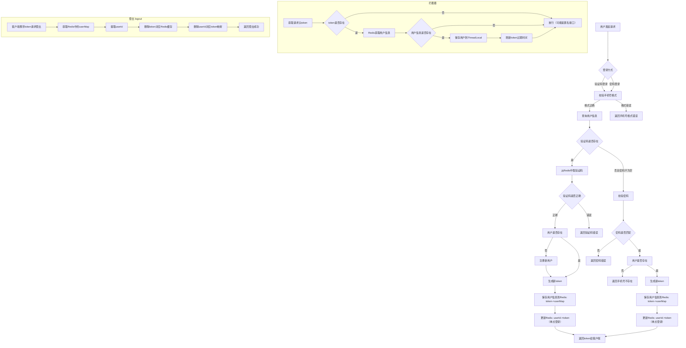
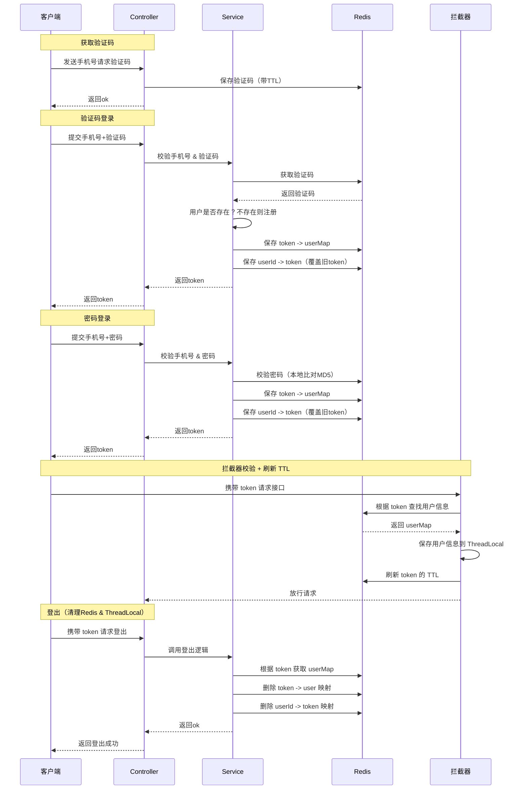
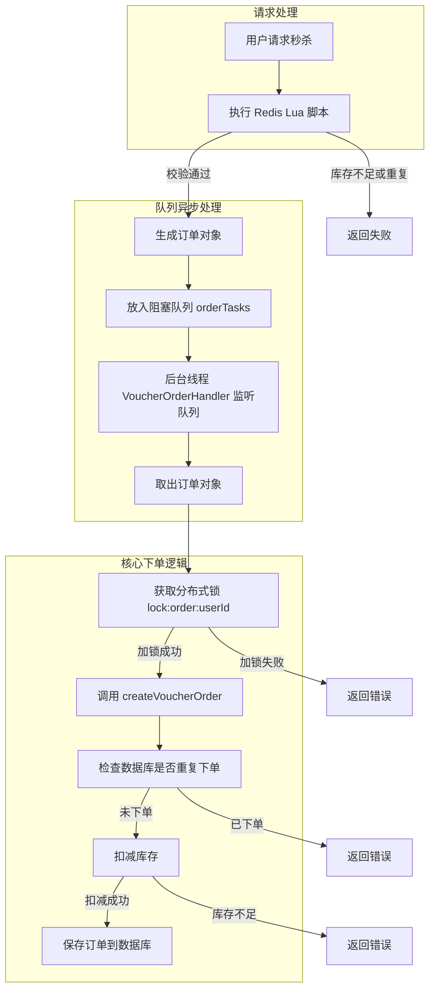

# 前言


## 导入SQL


## 导入后端项目


## 导入前端工程


# 短信登录

## 基于Session实现短信登录

**发送验证码：**

用户在提交手机号后，会校验手机号是否合法，如果不合法，则要求用户重新输入手机号

如果手机号合法，后台此时生成对应的验证码，同时将验证码进行保存，然后再通过短信的方式将验证码发送给用户

**短信验证码登录、注册：**

用户将验证码和手机号进行输入，后台从session中拿到当前验证码，然后和用户输入的验证码进行校验，如果不一致，则无法通过校验，如果一致，则后台根据手机号查询用户，如果用户不存在，则为用户创建账号信息，保存到数据库，无论是否存在，都会将用户信息保存到session中，方便后续获得当前登录信息

**校验登录状态:**

用户在请求时候，会从cookie中携带者JsessionId到后台，后台通过JsessionId从session中拿到用户信息，如果没有session信息，则进行拦截，如果有session信息，则将用户信息保存到threadLocal中，并且放行


### 发送验证码功能

#### 校验手机号

```java
package com.hmdp.utils;

public abstract class RegexPatterns {
	// 手机号正则
    public static final String PHONE_REGEX = "^1([38][0-9]|4[579]|5[0-3,5-9]|6[6]|7[0135678]|9[89])\\d{8}$";
    
	// 邮箱正则
    public static final String EMAIL_REGEX = "^[a-zA-Z0-9_-]+@[a-zA-Z0-9_-]+(\\.[a-zA-Z0-9_-]+)+$";
    
	// 密码正则。4~32位的字母、数字、下划线
    public static final String PASSWORD_REGEX = "^\\w{4,32}$";

	// 验证码正则, 6位数字或字母
    public static final String VERIFY_CODE_REGEX = "^[a-zA-Z\\d]{6}$";

}

```

手机号正则说明：

1. `^` - 表示匹配字符串的开始
2. `1` - 手机号码的第一位必须是1
3. `([38][0-9]|4[579]|5[0-3,5-9]|6[6]|7[0135678]|9[89])` - 匹配手机号码的第二位和第三位，这是一个分组，包含多个选项，用`|`分隔：
    - `[38][0-9]`：第二位是3或8，第三位是任意数字
    - `4[579]`：第二位是4，第三位是5、7或9
    - `5[0-3,5-9]`：第二位是5，第三位是0-3或5-9（注意这里有个逗号，应该是笔误，应该是`5[0-35-9]`）
    - `6[6]`：第二位是6，第三位是6
    - `7[0135678]`：第二位是7，第三位是0、1、3、5、6、7或8
    - `9[89]`：第二位是9，第三位是8或9
4. `\d{8}` - 匹配接下来的8位数字（\d表示任意数字，{8}表示重复8次）
5. `$` - 表示匹配字符串的结束

```java
package com.hmdp.utils;

import cn.hutool.core.util.StrUtil;

public class RegexUtils {
    /**
     * 是否是无效手机格式
     * @param phone 要校验的手机号
     * @return true:符合，false：不符合
     */
    public static boolean isPhoneInvalid(String phone){
        return mismatch(phone, RegexPatterns.PHONE_REGEX);
    }
    /**
     * 是否是无效邮箱格式
     * @param email 要校验的邮箱
     * @return true:符合，false：不符合
     */
    public static boolean isEmailInvalid(String email){
        return mismatch(email, RegexPatterns.EMAIL_REGEX);
    }

    /**
     * 是否是无效验证码格式
     * @param code 要校验的验证码
     * @return true:符合，false：不符合
     */
    public static boolean isCodeInvalid(String code){
        return mismatch(code, RegexPatterns.VERIFY_CODE_REGEX);
    }

    // 校验是否不符合正则格式
    private static boolean mismatch(String str, String regex){
        if (StrUtil.isBlank(str)) {
            return true;
        }
        return !str.matches(regex);
    }
}

```


#### 发送验证码

```java
@Override
public Result sendCode(String phone, HttpSession session) {
    // 1.校验手机号
    if (RegexUtils.isPhoneInvalid(phone)) {
        // 2.如果不符合，返回错误信息
        return Result.fail("手机号格式错误！");
    }
    // 3.符合，生成验证码
    String code = RandomUtil.randomNumbers(6);

    // 4.保存验证码到 session
    session.setAttribute("code",code);

    // 5.发送验证码
    log.debug("发送短信验证码成功，验证码：{}", code);
    // 返回ok
    return Result.ok();
}
```

**HttpSession**

`HttpSession` 是 Java Servlet 提供的一个接口，用于在服务端记录用户会话（session）信息。每一个用户在浏览器和服务器之间的交互，都会被服务端创建一个唯一的 `HttpSession` 对象来维护该用户的状态。

当用户第一次访问应用时，服务器会创建一个 `HttpSession` 实例，并分配一个唯一的 `Session ID`。这个 ID 会存储在浏览器的 Cookie 中，并在每次请求时自动发送给服务器，从而保持状态。


**Session ID 是如何返回给前端的？**

在 Web 应用中，**Session 用于保存用户的状态信息**，而前端和服务器之间的状态识别是通过 **Session ID** 实现的

第一次请求时（用户还没有 Session）：

1. 浏览器首次向服务器发起请求（如 `/user/code?phone=...`）
2. 服务器检测到请求中没有携带 `Session ID`，于是自动创建一个新的 `HttpSession` 对象
3. 系统为这个 `HttpSession` 分配一个唯一标识，比如：`JSESSIONID=ABC123XYZ456`
4. 服务器在响应头中添加内容：`Set-Cookie: JSESSIONID=ABC123XYZ456; Path=/; HttpOnly`
5. 浏览器接收响应后，会自动将这个 Cookie（JSESSIONID）保存下来

后续请求时（用户已建立 Session）：

1. 浏览器再次请求服务器（如 `/user/me`），自动携带 Cookie：Cookie: JSESSIONID=ABC123XYZ456
2. 服务器通过这个 ID 获取对应的 `HttpSession`，读取其中保存的信息（如验证码、用户登录状态等）


### 登录功能

#### 登录

```java
@Override
public Result login(LoginFormDTO loginForm, HttpSession session) {
    // 校验手机号
    String phone = loginForm.getPhone();
    if (RegexUtils.isPhoneInvalid(phone)) {
        // 2.如果不符合，返回错误信息
        return Result.fail("手机号格式错误！");
    }

    //根据手机号查询用户
    User user = query().eq("phone", phone).one();

    if (StrUtil.isNotBlank(loginForm.getCode())) {
        // 1）验证码登录
        // 校验验证码
        Object cacheCode = session.getAttribute("code");
        String code = loginForm.getCode();
        if(cacheCode == null || !cacheCode.toString().equals(code)){
            //3.不一致，报错
            return Result.fail("验证码错误");
        }

        //判断用户是否存在
        if(user == null){
            //不存在，则创建
            user =  createUserWithPhone(phone);
        }
        // 保存用户信息到session中
        session.setAttribute("user",user);

        return Result.ok();
    } else if (StrUtil.isNotBlank(loginForm.getPassword())) {
        // 2）密码登录

        //判断用户是否存在
        if(user == null){
            //不存在（不能创建用户）
            return Result.fail("手机号不存在");
        }

        // 校验密码
        String inputPassword = loginForm.getPassword();
        String inputPasswordMd5 = DigestUtils.md5Hex(inputPassword);
        if (!inputPasswordMd5.equals(user.getPassword())) {
            return Result.fail("密码输入错误");
        }

        // 保存用户信息到session中
        session.setAttribute("user",user);

        return Result.ok();
    } else {
        return Result.fail("登录失败");
    }
}

private User createUserWithPhone(String phone) {
    User user = new User();
    user.setPhone(phone);
    user.setNickName(USER_NICK_NAME_PREFIX + RandomUtil.randomString(10));
    user.setPassword(DigestUtils.md5Hex("123456"));
    save(user);
    return user;
}
```


#### 自动字段填充

创建新用户时，数据库的`create_time`和`update_time`需要自动填充

1）字段添加注解

```java
public class User implements Serializable {

    @TableField(fill = FieldFill.INSERT)
    private LocalDateTime createTime;

    @TableField(fill = FieldFill.UPDATE)
    private LocalDateTime updateTime;
}

```

2）实现 MetaObjectHandler

```java
package com.hmdp.config;

import com.baomidou.mybatisplus.core.handlers.MetaObjectHandler;
import lombok.extern.slf4j.Slf4j;
import org.apache.ibatis.reflection.MetaObject;
import org.springframework.stereotype.Component;

import java.time.LocalDateTime;

/**
 * 自动填充字段
 */
@Slf4j
@Component
public class MyMetaObjectHandler implements MetaObjectHandler {

    @Override
    public void insertFill(MetaObject metaObject) {
        log.info("开始插入填充...");
        this.strictInsertFill(metaObject, "createTime", LocalDateTime.class, LocalDateTime.now());
    }

    @Override
    public void updateFill(MetaObject metaObject) {
        log.info("开始更新填充...");
        this.strictUpdateFill(metaObject, "updateTime", LocalDateTime.class, LocalDateTime.now());
    }
}

```


#### 数据校验

1）引入依赖

```xml
<!-- 数据校验 -->
<dependency>
    <groupId>javax.validation</groupId>
    <artifactId>validation-api</artifactId>
</dependency>
<!-- 数据校验 -->
<dependency>
    <groupId>org.hibernate.validator</groupId>
    <artifactId>hibernate-validator</artifactId>
</dependency>
```

2）给`LoginFormDTO.java`添加注解

```java
public class LoginFormDTO {
    @NotBlank(message = "手机号不能为空")
    @Pattern(regexp = RegexPatterns.PHONE_REGEX, message = "手机号格式错误")
    private String phone;

    @Pattern(regexp = RegexPatterns.VERIFY_CODE_REGEX, message = "验证码格式错误")
    private String code;

    @Pattern(regexp = RegexPatterns.PASSWORD_REGEX, message = "密码格式错误")
    private String password;
}
```

3）Controller 方法上加 `@Valid`

```java
@PostMapping("/login")
public Result login(@RequestBody @Valid LoginFormDTO loginForm, HttpSession session){
    return userService.login(loginForm, session);
}
```

4）全局异常处理器

```java
package com.hmdp.exception;

import com.hmdp.dto.Result;
import lombok.extern.slf4j.Slf4j;
import org.springframework.validation.FieldError;
import org.springframework.web.bind.MethodArgumentNotValidException;
import org.springframework.web.bind.annotation.ExceptionHandler;
import org.springframework.web.bind.annotation.RestControllerAdvice;

/**
 * 全局异常处理器
 */
@RestControllerAdvice
@Slf4j
public class GlobalExceptionHandler {

    /**
     * 捕获数据校验异常
     * @param ex
     * @return
     */
    @ExceptionHandler(MethodArgumentNotValidException.class)
    public Result handleValidationExceptions(MethodArgumentNotValidException ex) {
        log.error("数据校验出现问题：{}，异常类型：{}", ex.getMessage(), ex.getClass());
        StringBuilder sb = new StringBuilder();
        for (FieldError error : ex.getBindingResult().getFieldErrors()) {
            sb.append(error.getDefaultMessage()).append("; ");
        }
        return Result.fail(sb.toString());
    }
}

```


#### md5加密

1）引入依赖

```xml
<!--md5加密-->
<dependency>
    <groupId>commons-codec</groupId>
    <artifactId>commons-codec</artifactId>
</dependency>
```

2）加密存储

```java
private User createUserWithPhone(String phone) {
    User user = new User();
    user.setPhone(phone);
    user.setNickName(USER_NICK_NAME_PREFIX + RandomUtil.randomString(10));
    user.setPassword(DigestUtils.md5Hex("123456"));
    save(user);
    return user;
}
```

3）加密对比

```java
// 校验密码
String inputPassword = loginForm.getPassword();
String inputPasswordMd5 = DigestUtils.md5Hex(inputPassword);
if (!inputPasswordMd5.equals(user.getPassword())) {
    return Result.fail("密码输入错误");
}
```


### 退出功能

```java
@PostMapping("/logout")
public Result logout(HttpSession session){
    session.removeAttribute("user");
    return Result.ok();
}
```

- 登录成功后你是通过 `session.setAttribute("user", userDTO)` 保存用户登录态的

- 用户每次请求时，Spring Boot 都会从当前 Session 中取出 `"user"`

- 登出时清除 `"user"`，就等于用户下次请求时被拦截器拦截（因为检测不到登录信息）


### 实现登录拦截功能


1）编写拦截器

```java
package com.hmdp.interceptor;

import com.hmdp.entity.User;
import com.hmdp.utils.UserHolder;
import org.springframework.web.servlet.HandlerInterceptor;

import javax.servlet.http.HttpServletRequest;
import javax.servlet.http.HttpServletResponse;
import javax.servlet.http.HttpSession;

/**
 * 登录拦截器
 */
public class LoginInterceptor implements HandlerInterceptor {

    @Override
    public boolean preHandle(HttpServletRequest request, HttpServletResponse response, Object handler) throws Exception {
        //1.获取session
        HttpSession session = request.getSession();
        //2.获取session中的用户
        Object user = session.getAttribute("user");
        //3.判断用户是否存在
        if(user == null){
            //4.不存在，拦截，返回401状态码
            response.setStatus(401);
            return false;
        }
        //5.存在，保存用户信息到Threadlocal
        UserHolder.saveUser((User) user);
        //6.放行
        return true;
    }

    @Override
    public void afterCompletion(HttpServletRequest request, HttpServletResponse response, Object handler, Exception ex) throws Exception {
        UserHolder.removeUser(); // 清理 ThreadLocal
    }
}

```

2）配置MvcConfig，让拦截器生效

```java
package com.hmdp.config;

import com.hmdp.interceptor.LoginInterceptor;
import org.springframework.context.annotation.Configuration;
import org.springframework.web.servlet.config.annotation.InterceptorRegistry;
import org.springframework.web.servlet.config.annotation.WebMvcConfigurer;

@Configuration
public class MvcConfig implements WebMvcConfigurer {
    
    @Override
    public void addInterceptors(InterceptorRegistry registry) {
        // 登录拦截器
        registry.addInterceptor(new LoginInterceptor())
                .excludePathPatterns(
                        "/shop/**",
                        "/voucher/**",
                        "/shop-type/**",
                        "/upload/**",
                        "/blog/hot",
                        "/user/code",
                        "/user/login"
                ).order(1);
    }
}
```

3）封装ThreadLocal

```java
package com.hmdp.utils;

import com.hmdp.entity.User;

public class UserHolder {
    private static final ThreadLocal<User> tl = new ThreadLocal<>();

    public static void saveUser(User user){
        tl.set(user);
    }

    public static User getUser(){
        return tl.get();
    }

    public static void removeUser(){
        tl.remove();
    }
}

```


## Session共享问题


## 基于Redis实现短信登录

[基于Redis实现短信登录的相关图](#图)


同时Redis保存userId -> token的映射，用于实现单点登录


### 发送验证码

```java
public Result sendCode(String phone, HttpSession session) {
    // 1.校验手机号
    if (RegexUtils.isPhoneInvalid(phone)) {
    // 2.如果不符合，返回错误信息
    return Result.fail("手机号格式错误！");
    }
    // 3.符合，生成验证码
    String code = RandomUtil.randomNumbers(6);

    // 4.保存验证码到 redis
    stringRedisTemplate.opsForValue().set(LOGIN_CODE_KEY + phone, code, LOGIN_CODE_TTL, TimeUnit.MINUTES);

    // 5.发送验证码
    log.debug("发送短信验证码成功，验证码：{}", code);

    // 返回ok
    return Result.ok();
}
```


### 登录（单点登录）

```java
public Result login(LoginFormDTO loginForm, HttpSession session) {
    // 校验手机号
    String phone = loginForm.getPhone();
    if (RegexUtils.isPhoneInvalid(phone)) {
        // 如果不符合，返回错误信息
        return Result.fail("手机号格式错误！");
    }

    //根据手机号查询用户
    User user = query().eq("phone", phone).one();

    if (StrUtil.isNotBlank(loginForm.getCode())) {
        // 1）验证码登录
        // 校验验证码
        String cacheCode = stringRedisTemplate.opsForValue().get(LOGIN_CODE_KEY + phone);
        String code = loginForm.getCode();
        if(cacheCode == null || !cacheCode.equals(code)){
            //不一致，报错
            return Result.fail("验证码错误");
        }

        //判断用户是否存在
        if(user == null){
            //不存在，则创建
            user =  createUserWithPhone(phone);
        }
        // 保存用户（已存在）信息到redis中
        String token = saveLoginUser(user);

        // 返回token
        return Result.ok(token);
    } else if (StrUtil.isNotBlank(loginForm.getPassword())) {
        // 2）密码登录

        //判断用户是否存在
        if(user == null){
            //不存在（不能创建用户）
            return Result.fail("手机号不存在");
        }

        // 校验密码
        String inputPassword = loginForm.getPassword();
        String inputPasswordMd5 = DigestUtils.md5Hex(inputPassword);
        if (!inputPasswordMd5.equals(user.getPassword())) {
            return Result.fail("密码输入错误");
        }

        // 保存用户信息到redis中
        String token = saveLoginUser(user);

        // 返回token
        return Result.ok(token);
    } else {
        return Result.fail("登录失败");
    }
}

private String saveLoginUser(User user) {
    String oldToken = stringRedisTemplate.opsForValue().get(LOGIN_USER_ID + user.getId());
    if (StrUtil.isNotBlank(oldToken)) {
        log.info("删除旧token");
        stringRedisTemplate.delete(LOGIN_USER_KEY + oldToken);
    }

   Map<String, Object> userMap = BeanUtil.beanToMap(user, new HashMap<>(), CopyOptions.create().setIgnoreNullValue(true).setFieldValueEditor((fieldName, fieldValue) -> fieldValue.toString()));
    String token = UUID.randomUUID().toString(true);
    stringRedisTemplate.opsForHash().putAll(LOGIN_USER_KEY + token, userMap);
    stringRedisTemplate.expire(LOGIN_USER_KEY + token, Duration.ofMinutes(LOGIN_USER_TTL)); // 设置过期时间

    stringRedisTemplate.opsForValue().set(LOGIN_USER_ID + user.getId(), token, Duration.ofMinutes(LOGIN_USER_TTL));

    return token;
}

private User createUserWithPhone(String phone) {
        User user = new User();
        user.setPhone(phone);
        user.setNickName(USER_NICK_NAME_PREFIX + RandomUtil.randomString(10));
        user.setPassword(DigestUtils.md5Hex("123456"));
        save(user);
        return user;
    }
```


### 拦截器


1）LoginInterceptor

```java
package com.hmdp.interceptor;

import com.hmdp.utils.UserHolder;

import org.springframework.web.servlet.HandlerInterceptor;
import javax.servlet.http.HttpServletRequest;
import javax.servlet.http.HttpServletResponse;


/**
 * 登录拦截器
 */
public class LoginInterceptor implements HandlerInterceptor {
    @Override
    public boolean preHandle(HttpServletRequest request, HttpServletResponse response, Object handler) throws Exception {
        // 1.判断是否需要拦截（ThreadLocal中是否有用户）
        if (UserHolder.getUser() == null) {
            // 没有，需要拦截，设置状态码
            response.setStatus(401);
            // 拦截
            return false;
        }
        // 有用户，则放行
        return true;
    }
}

```

2）RefreshTokenInterceptor

```java
package com.hmdp.interceptor;

import cn.hutool.core.bean.BeanUtil;
import cn.hutool.core.util.StrUtil;
import com.hmdp.entity.User;
import com.hmdp.utils.RedisConstants;
import com.hmdp.utils.UserHolder;
import org.springframework.data.redis.core.StringRedisTemplate;
import org.springframework.web.servlet.HandlerInterceptor;

import javax.servlet.http.HttpServletRequest;
import javax.servlet.http.HttpServletResponse;
import java.util.Map;
import java.util.concurrent.TimeUnit;

public class RefreshTokenInterceptor implements HandlerInterceptor {
    private StringRedisTemplate stringRedisTemplate;

    public RefreshTokenInterceptor(StringRedisTemplate stringRedisTemplate) {
        this.stringRedisTemplate = stringRedisTemplate;
    }

    @Override
    public boolean preHandle(HttpServletRequest request, HttpServletResponse response, Object handler) throws Exception {
        //1.获取请求头中的token
        String token = request.getHeader("authorization");

        if (StrUtil.isBlank(token)) {
            return true;
        }

        //2.获取Redis中的用户
        Map<Object, Object> userMap = stringRedisTemplate.opsForHash().entries(RedisConstants.LOGIN_USER_KEY + token);
        //3.判断用户是否存在
        if(userMap.isEmpty()){
            return true;
        }
        //5.存在，保存用户信息到Threadlocal
        User user = BeanUtil.fillBeanWithMap(userMap, new User(), false);
        UserHolder.saveUser(user);
        // 6.刷新token
        stringRedisTemplate.expire(RedisConstants.LOGIN_USER_KEY + token, RedisConstants.LOGIN_USER_TTL, TimeUnit.MINUTES);
        //7.放行
        return true;
    }

    @Override
    public void afterCompletion(HttpServletRequest request, HttpServletResponse response, Object handler, Exception ex) throws Exception {
        UserHolder.removeUser(); // 清理 ThreadLocal
    }
}

```

3）配置MvcConfig，让拦截器生效

```java
package com.hmdp.config;

import com.hmdp.interceptor.LoginInterceptor;
import com.hmdp.interceptor.RefreshTokenInterceptor;
import org.springframework.context.annotation.Configuration;
import org.springframework.data.redis.core.StringRedisTemplate;
import org.springframework.web.servlet.config.annotation.InterceptorRegistry;
import org.springframework.web.servlet.config.annotation.WebMvcConfigurer;

import javax.annotation.Resource;

@Configuration
public class MvcConfig implements WebMvcConfigurer {

    @Resource
    private StringRedisTemplate stringRedisTemplate;

    @Override
    public void addInterceptors(InterceptorRegistry registry) {
        // 登录拦截器
        registry.addInterceptor(new LoginInterceptor())
                .excludePathPatterns(
                        "/shop/**",
                        "/voucher/**",
                        "/shop-type/**",
                        "/upload/**",
                        "/blog/hot",
                        "/user/code",
                        "/user/login"
                ).order(1);
        // token刷新拦截器
        registry.addInterceptor(new RefreshTokenInterceptor(stringRedisTemplate)).addPathPatterns("/**").order(0);
    }
}
```


### 退出功能

1）Controller

```java
@PostMapping("/logout")
public Result logout(@RequestHeader("authorization") String token){
    userService.logout(token);
    return Result.ok();
}
```

2）UserServiceImpl

```java
@Override
public void logout(String token) {
    // 1. 从 Redis 中获取用户信息
    Map<Object, Object> userMap = stringRedisTemplate.opsForHash().entries(RedisConstants.LOGIN_USER_KEY + token);
    Object userId = userMap.get("id"); // 立刻获取 userId，防止 Redis 中数据已被删或被并发清空

    // 2. 删除 Redis 中的 token -> 用户信息 映射
    stringRedisTemplate.delete(LOGIN_USER_KEY + token);
    log.info("删除Redis中的 token 映射");

    // 3. 删除 Redis 中的 userId -> token 映射
    if (userId != null) {
        stringRedisTemplate.delete(LOGIN_USER_ID + userId);
        log.info("删除Redis中的 userId 映射");
    }
}
```


# 商户查询缓存

## 缓存模型和思路

标准的操作方式就是查询数据库之前先查询缓存，如果缓存数据存在，则直接从缓存中返回，如果缓存数据不存在，再查询数据库，然后将数据存入redis


## 商户缓存

```java
@Override
public Result queryById(Long id) {
    String key = RedisConstants.CACHE_SHOP_KEY + id;
    // 从redis查询商户缓存
    String shopJson = stringRedisTemplate.opsForValue().get(key);

    if (StrUtil.isNotBlank(shopJson)) {
        // 缓存存在
        Shop shop = JSONUtil.toBean(shopJson, Shop.class);
        return Result.ok(shop);
    } else {
        // 缓存不存在
        Shop shop = this.getById(id);
        if (shop == null) {
            // 数据库不存在
            return Result.fail("商铺不存在！");
        } else {
            // 数据库存在
            stringRedisTemplate.opsForValue().set(key, JSONUtil.toJsonStr(shop));
            return Result.ok(shop);
        }
    }
}
```


## 缓存更新策略


## 数据库缓存不一致

### 说明

由于我们的**缓存的数据源来自于数据库**,而数据库的**数据是会发生变化的**,因此,如果当数据库中**数据发生变化,而缓存却没有同步**,此时就会有**一致性问题存在**,其后果是:

用户使用缓存中的过时数据,就会产生类似多线程数据安全问题,从而影响业务,产品口碑等;

**解决方案：**


Cache Aside Pattern 人工编码方式：缓存调用者在更新完数据库后再去更新缓存，也称之为双写方案

Read/Write Through Pattern : 由系统本身完成，数据库与缓存的问题交由系统本身去处理

Write Behind Caching Pattern ：调用者只操作缓存，其他线程去异步处理数据库，实现最终一致


综合考虑使用方案一

操作缓存和数据库时有三个问题需要考虑：

* 删除缓存还是更新缓存？
    * 更新缓存：每次更新数据库都更新缓存，无效写操作较多
    * 删除缓存：更新数据库时让缓存失效，查询时再更新缓存✅
* 如何保证缓存与数据库的操作的同时成功或失败？
    * 单体系统，将缓存与数据库操作放在一个事务
    * 分布式系统，利用TCC等分布式事务方案
* 先操作缓存还是先操作数据库？（不加锁的情况下，只考虑数据不一致发生的概率，选择第二种）
	* 先删除缓存，再操作数据库
	* 先操作数据库，再删除缓存✅


如果采用第一个方案，那么假设我们每次操作数据库后，都操作缓存，但是中间如果没有人查询，那么这个更新动作实际上只有最后一次生效，中间的更新动作意义并不大，我们可以把缓存删除，等待再次查询时，将缓存中的数据加载出来


应该具体操作缓存还是操作数据库，我们应当是==先操作数据库，再删除缓存==，原因在于，如果你选择第一种方案，在两个线程并发来访问时，假设线程1先来，他先把缓存删了，此时线程2过来，他查询缓存数据并不存在，此时他写入缓存，当他写入缓存后，线程1再执行更新动作时，实际上写入的就是旧的数据，新的数据被旧数据覆盖了


### 完善代码

```java
/**
* 根据id查询商户
* @param id
* @return
*/
@Override
public Shop queryById(Long id) {
    String key = RedisConstants.CACHE_SHOP_KEY + id;
    // 从redis查询商户缓存
    String shopJson = stringRedisTemplate.opsForValue().get(key);

    if (StrUtil.isNotBlank(shopJson)) {
        // 缓存存在
        Shop shop = JSONUtil.toBean(shopJson, Shop.class);
        return shop;
    } else {
        // 缓存不存在
        Shop shop = this.getById(id);
        if (shop == null) {
            // 数据库不存在
            throw new NoDataException("数据不存在");
        } else {
            // 数据库存在
            stringRedisTemplate.opsForValue().set(key, JSONUtil.toJsonStr(shop), RedisConstants.CACHE_SHOP_TTL, TimeUnit.MINUTES);
            return shop;
        }
    }
}

/**
* 更新商户信息
* @param shop
*/
@Override
@Transactional
public void updateShop(Shop shop) {
    Long id = shop.getId();
    if (id == null) {
        throw new NoDataException("数据不存在");
    }

    // 更新数据库
    this.updateById(shop);

    // 删除缓存
    stringRedisTemplate.delete(RedisConstants.CACHE_SHOP_KEY + id);
}
```


## 缓存穿透

### 说明

缓存穿透 ：缓存穿透是指客户端请求的数据在缓存中和数据库中都不存在，这样缓存永远不会生效，这些请求都会打到数据库

常见的解决方案有两种：

* 缓存空对象
    * 优点：实现简单，维护方便
    * 缺点：
        * 额外的内存消耗
        * 可能造成短期的不一致
* 布隆过滤
    * 优点：内存占用较少，没有多余key
    * 缺点：
        * 实现复杂
        * 存在误判可能

**缓存空对象思路分析：**当我们客户端访问不存在的数据时，先请求redis，但是此时redis中没有数据，此时会访问到数据库，但是数据库中也没有数据，这个数据穿透了缓存，直击数据库，我们都知道数据库能够承载的并发不如redis这么高，如果大量的请求同时过来访问这种不存在的数据，这些请求就都会访问到数据库，简单的解决方案就是哪怕这个数据在数据库中也不存在，我们也把这个数据存入到redis中去，这样，下次用户过来访问这个不存在的数据，那么在redis中也能找到这个数据就不会进入到缓存了

**布隆过滤：**布隆过滤器其实采用的是哈希思想来解决这个问题，通过一个庞大的二进制数组，走哈希思想去判断当前这个要查询的这个数据是否存在，如果布隆过滤器判断存在，则放行，这个请求会去访问redis，哪怕此时redis中的数据过期了，但是数据库中一定存在这个数据，在数据库中查询出来这个数据后，再将其放入到redis中，

假设布隆过滤器判断这个数据不存在，则直接返回

这种方式优点在于节约内存空间，存在误判，误判原因在于：布隆过滤器走的是哈希思想，只要哈希思想，就可能存在哈希冲突


### 完善代码

现在的逻辑中：如果这个数据不存在，我们不会返回404 ，还是会把这个数据写入到Redis中，并且将value设置为空，当再次发起查询时，我们如果发现命中之后，判断这个value是否是null，如果是null，则是之前写入的数据，证明是缓存穿透数据，如果不是，则直接返回数据


缓存穿透产生的原因是什么？

* 用户请求的数据在缓存中和数据库中都不存在，不断发起这样的请求，给数据库带来巨大压力

缓存穿透的解决方案有哪些？

* 缓存null值
* 布隆过滤
* 增强id的复杂度，避免被猜测id规律
* 做好数据的基础格式校验
* 加强用户权限校验
* 做好热点参数的限流

**ShopServiceImpl**

```java
@Override
public Shop queryById(Long id) {
    String key = RedisConstants.CACHE_SHOP_KEY + id;
    // 从redis查询商户缓存
    String shopJson = stringRedisTemplate.opsForValue().get(key);

    // isNotBlank("") 为false，isNotBlank(null) 为false
    if (StrUtil.isNotBlank(shopJson)) {
        // 缓存命中（非空非null）
        Shop shop = JSONUtil.toBean(shopJson, Shop.class);
        return shop;
    } else {
        // 缓存命中，但是为""值
        if (shopJson != null) {
            throw new NoDataException("数据不存在");
        }

        // 缓存不存在
        Shop shop = this.getById(id);
        if (shop == null) {
            // 缓存空值
            stringRedisTemplate.opsForValue().set(key, "", RedisConstants.CACHE_NULL_TTL, TimeUnit.MINUTES);
            // 数据库不存在
            throw new NoDataException("数据不存在");
        } else {
            // 数据库存在
            stringRedisTemplate.opsForValue().set(key, JSONUtil.toJsonStr(shop), RedisConstants.CACHE_SHOP_TTL, TimeUnit.MINUTES);
            return shop;
        }
    }
}
```


## 缓存雪崩

### 说明

缓存雪崩是指在同一时段大量的缓存key同时失效或者Redis服务宕机，导致大量请求到达数据库，带来巨大压力。

解决方案：

* 给不同的Key的TTL添加随机值
* 利用Redis集群提高服务的可用性
* 给缓存业务添加降级限流策略
* 给业务添加多级缓存


## 缓存击穿

### 说明

缓存击穿问题也叫热点Key问题，就是一个被高并发访问并且缓存重建业务较复杂的key突然失效了，无数的请求访问会在瞬间给数据库带来巨大的冲击

常见的解决方案有两种：

* 互斥锁
* 逻辑过期

逻辑分析：假设线程1在查询缓存之后，本来应该去查询数据库，然后把这个数据重新加载到缓存的，此时只要线程1走完这个逻辑，其他线程就都能从缓存中加载这些数据了，但是假设在线程1没有走完的时候，后续的线程2，线程3，线程4同时过来访问当前这个方法， 那么这些线程都不能从缓存中查询到数据，那么他们就会同一时刻来访问查询缓存，都没查到，接着同一时间去访问数据库，同时的去执行数据库代码，对数据库访问压力过大


**解决方案一、使用锁来解决：**

因为锁能实现互斥性。假设线程过来，只能一个人一个人的来访问数据库，从而避免对于数据库访问压力过大，但这也会影响查询的性能，因为此时会让查询的性能从并行变成了串行，我们可以采用tryLock方法 + double check来解决这样的问题。

假设现在线程1过来访问，他查询缓存没有命中，但是此时他获得到了锁的资源，那么线程1就会一个人去执行逻辑，假设现在线程2过来，线程2在执行过程中，并没有获得到锁，那么线程2就可以进行到休眠，直到线程1把锁释放后，线程2获得到锁，然后再来执行逻辑，此时就能够从缓存中拿到数据了


**解决方案二、逻辑过期方案：**

方案分析：我们之所以会出现这个缓存击穿问题，主要原因是在于我们对key设置了过期时间，假设我们不设置过期时间，其实就不会有缓存击穿的问题，但是不设置过期时间，这样数据不就一直占用我们内存了吗，我们可以采用逻辑过期方案。

我们把过期时间设置在 redis的value中，注意：这个过期时间并不会直接作用于redis，而是我们后续通过逻辑去处理。假设线程1去查询缓存，然后从value中判断出来当前的数据已经过期了，此时线程1去获得互斥锁，那么其他线程会进行阻塞，获得了锁的线程他会开启一个 线程去进行 以前的重构数据的逻辑，直到新开的线程完成这个逻辑后，才释放锁， 而线程1直接进行返回，假设现在线程3过来访问，由于线程线程2持有着锁，所以线程3无法获得锁，线程3也直接返回数据，只有等到新开的线程2把重建数据构建完后，其他线程才能走返回正确的数据。

这种方案巧妙在于，异步的构建缓存，缺点在于在构建完缓存之前，返回的都是脏数据


进行对比

**互斥锁方案：**由于保证了互斥性，所以数据一致，且实现简单，因为仅仅只需要加一把锁而已，也没其他的事情需要操心，所以没有额外的内存消耗，缺点在于有锁就有死锁问题的发生，且只能串行执行性能肯定受到影响

**逻辑过期方案：** 线程读取过程中不需要等待，性能好，有一个额外的线程持有锁去进行重构数据，但是在重构数据完成前，其他的线程只能返回之前的数据，且实现起来麻烦


### 完善代码

#### 互斥锁

核心思路：相较于原来从缓存中查询不到数据后直接查询数据库而言，现在的方案是 进行查询之后，如果从缓存没有查询到数据，则进行互斥锁的获取，获取互斥锁后，判断是否获得到了锁，如果没有获得到，则休眠，过一会再进行尝试，直到获取到锁为止，才能进行查询

如果获取到了锁的线程，再去进行查询，查询后将数据写入redis，再释放锁，返回数据，==利用互斥锁就能保证只有一个线程去执行操作数据库的逻辑==，防止缓存击穿


核心思路就是利用redis的setnx方法来表示获取锁，该方法含义是redis中如果没有这个key，则插入成功，返回1，在stringRedisTemplate中返回true，  如果有这个key则插入失败，则返回0，在stringRedisTemplate返回false，我们可以通过true，或者是false，来表示是否有线程成功插入key，成功插入的key的线程我们认为他就是获得到锁的线程

**shopServiceImpl**

缓存穿透和缓存击穿的双重防护机制

```java
@Override
public Shop queryById(Long id) {
    String key = RedisConstants.CACHE_SHOP_KEY + id;
    // 从redis查询商户缓存
    String shopJson = stringRedisTemplate.opsForValue().get(key);

    // isNotBlank("") 为false，isNotBlank(null) 为false
    if (StrUtil.isNotBlank(shopJson)) {
        // 缓存命中（非空非null）
        Shop shop = JSONUtil.toBean(shopJson, Shop.class);
        return shop;
    } else {
        // 缓存命中，但是为""值
        if (shopJson != null) {
            throw new NoDataException("数据不存在");
        }

        // 缓存未命中（互斥锁）
        String lockKey = RedisConstants.LOCK_SHOP_KEY + id;

        Shop shop = null;
        try {
            boolean isLock = tryLock(lockKey);

            if (!isLock) {
                // 获取锁失败
                Thread.sleep(50);
                return queryById(id);
            } else {
                // 获取锁成功
                shop = this.getById(id);
                if (shop == null) {
                    // 缓存空值
                    stringRedisTemplate.opsForValue().set(key, "", RedisConstants.CACHE_NULL_TTL, TimeUnit.MINUTES);
                    // 数据库不存在
                    throw new NoDataException("数据不存在");
                } else {
                    // 数据库存在
                    stringRedisTemplate.opsForValue().set(key, JSONUtil.toJsonStr(shop), RedisConstants.CACHE_SHOP_TTL, TimeUnit.MINUTES);
                    return shop;
                }
            }
        } catch (Exception e) {
            throw new RuntimeException(e);
        } finally {
            // 释放锁
            unlock(lockKey);
        }
    }
}

/**
* 获取锁
* @param key
* @return
*/
private boolean tryLock(String key) {
    Boolean flag = stringRedisTemplate.opsForValue().setIfAbsent(key, "1", RedisConstants.LOCK_SHOP_TTL, TimeUnit.SECONDS);
    return BooleanUtil.isTrue(flag);
}

/**
* 释放锁
* @param key
*/
private void unlock(String key) {
    stringRedisTemplate.delete(key);
}
```


#### 逻辑过期

思路分析：当用户开始查询redis时，判断是否命中，如果没有命中则直接返回空数据，不查询数据库，而一旦命中后，将value取出，判断value中的过期时间是否满足，如果没有过期，则直接返回redis中的数据，如果过期，则在开启独立线程后直接返回之前的数据，独立线程去重构数据，重构完成后释放互斥锁


==借助 互斥锁 + 线程池异步刷新缓存 避免多个线程同时查数据库==

新建一个实体类，对原来代码没有侵入性

```java
@Data
public class RedisData {
    private LocalDateTime expireTime;
    private Object data;
}
```


**ShopServiceImpl**

```java
private static final ExecutorService CACHE_REBUILD_EXECUTOR = Executors.newFixedThreadPool(10);
public Shop queryWithLogicalExpire( Long id ) {
    String key = CACHE_SHOP_KEY + id;
    // 1.从redis查询商铺缓存
    String json = stringRedisTemplate.opsForValue().get(key);
    // 2.判断是否存在
    if (StrUtil.isBlank(json)) {
        // 3.存在，直接返回
        return null;
    }
    // 4.命中，需要先把json反序列化为对象
    RedisData redisData = JSONUtil.toBean(json, RedisData.class);
    Shop shop = JSONUtil.toBean((JSONObject) redisData.getData(), Shop.class);
    LocalDateTime expireTime = redisData.getExpireTime();
    // 5.判断是否过期
    if(expireTime.isAfter(LocalDateTime.now())) {
        // 5.1.未过期，直接返回店铺信息
        return shop;
    }
    // 5.2.已过期，需要缓存重建
    // 6.缓存重建
    // 6.1.获取互斥锁
    String lockKey = LOCK_SHOP_KEY + id;
    boolean isLock = tryLock(lockKey);
    // 6.2.判断是否获取锁成功
    if (isLock){
        CACHE_REBUILD_EXECUTOR.submit( ()->{

            try{
                //重建缓存
                this.saveShop2Redis(id,20L);
            }catch (Exception e){
                throw new RuntimeException(e);
            }finally {
                unlock(lockKey);
            }
        });
    }
    // 6.4.返回过期的商铺信息
    return shop;
}

public void saveShop2Redis(Long id, Long expireSeconds) {
    // 查询商户数据
    Shop = shop = getById(id);
    // 封装逻辑过期时间
    RedisData redisData = new RedisData();
    redisData.setData(shop);
    redisData.setExpireTime(LocalDateTime.now().plusSeconds(expireSeconds));
    // 写入Redis
    stringRedisTemplate.opsForValue().set(RedisConstant.CACHE_SHOP_KEY + id, JSONUtil.toJsonStr(redisData));
}
```

 基于逻辑过期时间的缓存更新方案，它的目标是防止缓存击穿（尤其是热点数据的缓存击穿）


## 封装Redis工具类

基于StringRedisTemplate封装一个缓存工具类，满足下列需求：

* 方法1：将任意Java对象序列化为json并存储在string类型的key中，并且可以设置TTL过期时间
* 方法2：将任意Java对象序列化为json并存储在string类型的key中，并且可以设置逻辑过期时间，用于处理缓存击穿问题

* 方法3：根据指定的key查询缓存，并反序列化为指定类型，利用缓存空值的方式解决缓存穿透问题
* 方法4：根据指定的key查询缓存，并反序列化为指定类型，需要利用逻辑过期解决缓存击穿问题（需要调用方法2）

将逻辑进行封装

```java
@Slf4j
@Component
public class CacheClient {

    private final StringRedisTemplate stringRedisTemplate;

    private static final ExecutorService CACHE_REBUILD_EXECUTOR = Executors.newFixedThreadPool(10);

    public CacheClient(StringRedisTemplate stringRedisTemplate) {
        this.stringRedisTemplate = stringRedisTemplate;
    }

    public void set(String key, Object value, Long time, TimeUnit unit) {
        stringRedisTemplate.opsForValue().set(key, JSONUtil.toJsonStr(value), time, unit);
    }

    public void setWithLogicalExpire(String key, Object value, Long time, TimeUnit unit) {
        // 设置逻辑过期
        RedisData redisData = new RedisData();
        redisData.setData(value);
        redisData.setExpireTime(LocalDateTime.now().plusSeconds(unit.toSeconds(time)));
        // 写入Redis
        stringRedisTemplate.opsForValue().set(key, JSONUtil.toJsonStr(redisData));
    }

    public <R,ID> R queryWithPassThrough(
            String keyPrefix, ID id, Class<R> type, Function<ID, R> dbFallback, Long time, TimeUnit unit){
        String key = keyPrefix + id;
        // 1.从redis查询商铺缓存
        String json = stringRedisTemplate.opsForValue().get(key);
        // 2.判断是否存在
        if (StrUtil.isNotBlank(json)) {
            // 3.存在，直接返回
            return JSONUtil.toBean(json, type);
        }
        // 判断命中的是否是空值
        if (json != null) {
            // 返回一个错误信息
            return null;
        }

        // 4.不存在，根据id查询数据库
        R r = dbFallback.apply(id);
        // 5.不存在，返回错误
        if (r == null) {
            // 将空值写入redis
            stringRedisTemplate.opsForValue().set(key, "", CACHE_NULL_TTL, TimeUnit.MINUTES);
            // 返回错误信息
            return null;
        }
        // 6.存在，写入redis
        this.set(key, r, time, unit);
        return r;
    }

    public <R, ID> R queryWithLogicalExpire(
            String keyPrefix, ID id, Class<R> type, Function<ID, R> dbFallback, Long time, TimeUnit unit) {
        String key = keyPrefix + id;
        // 1.从redis查询商铺缓存
        String json = stringRedisTemplate.opsForValue().get(key);
        // 2.判断是否存在
        if (StrUtil.isBlank(json)) {
            // 3.存在，直接返回
            return null;
        }
        // 4.命中，需要先把json反序列化为对象
        RedisData redisData = JSONUtil.toBean(json, RedisData.class);
        R r = JSONUtil.toBean((JSONObject) redisData.getData(), type);
        LocalDateTime expireTime = redisData.getExpireTime();
        // 5.判断是否过期
        if(expireTime.isAfter(LocalDateTime.now())) {
            // 5.1.未过期，直接返回店铺信息
            return r;
        }
        // 5.2.已过期，需要缓存重建
        // 6.缓存重建
        // 6.1.获取互斥锁
        String lockKey = LOCK_SHOP_KEY + id;
        boolean isLock = tryLock(lockKey);
        // 6.2.判断是否获取锁成功
        if (isLock){
            // 6.3.成功，开启独立线程，实现缓存重建
            CACHE_REBUILD_EXECUTOR.submit(() -> {
                try {
                    // 查询数据库
                    R newR = dbFallback.apply(id);
                    // 重建缓存
                    this.setWithLogicalExpire(key, newR, time, unit);
                } catch (Exception e) {
                    throw new RuntimeException(e);
                }finally {
                    // 释放锁
                    unlock(lockKey);
                }
            });
        }
        // 6.4.返回过期的商铺信息
        return r;
    }

    public <R, ID> R queryWithMutex(
            String keyPrefix, ID id, Class<R> type, Function<ID, R> dbFallback, Long time, TimeUnit unit) {
        String key = keyPrefix + id;
        // 1.从redis查询商铺缓存
        String shopJson = stringRedisTemplate.opsForValue().get(key);
        // 2.判断是否存在
        if (StrUtil.isNotBlank(shopJson)) {
            // 3.存在，直接返回
            return JSONUtil.toBean(shopJson, type);
        }
        // 判断命中的是否是空值
        if (shopJson != null) {
            // 返回一个错误信息
            return null;
        }

        // 4.实现缓存重建
        // 4.1.获取互斥锁
        String lockKey = LOCK_SHOP_KEY + id;
        R r = null;
        try {
            boolean isLock = tryLock(lockKey);
            // 4.2.判断是否获取成功
            if (!isLock) {
                // 4.3.获取锁失败，休眠并重试
                Thread.sleep(50);
                return queryWithMutex(keyPrefix, id, type, dbFallback, time, unit);
            }
            // 4.4.获取锁成功，根据id查询数据库
            r = dbFallback.apply(id);
            // 5.不存在，返回错误
            if (r == null) {
                // 将空值写入redis
                stringRedisTemplate.opsForValue().set(key, "", CACHE_NULL_TTL, TimeUnit.MINUTES);
                // 返回错误信息
                return null;
            }
            // 6.存在，写入redis
            this.set(key, r, time, unit);
        } catch (InterruptedException e) {
            throw new RuntimeException(e);
        }finally {
            // 7.释放锁
            unlock(lockKey);
        }
        // 8.返回
        return r;
    }

    private boolean tryLock(String key) {
        Boolean flag = stringRedisTemplate.opsForValue().setIfAbsent(key, "1", 10, TimeUnit.SECONDS);
        return BooleanUtil.isTrue(flag);
    }

    private void unlock(String key) {
        stringRedisTemplate.delete(key);
    }
}
```

**说明**

- `Function<ID, R>`是 Java 8 引入的 **函数式接口**，它接收一个参数 `T`（在你的代码里是 `ID`），返回一个结果 `R`
- `Function<ID, R>`  表示一个接受 ID 类型参数并返回 R 类型结果的函数接口
- `dbFallback.apply(id)`  实际调用函数（查数据库）


# 优惠券秒杀

## 全局唯一ID

**全局ID生成器**，是一种在分布式系统下用来生成全局唯一ID的工具，一般要满足下列特性：


为了增加ID的安全性，我们可以不直接使用Redis自增的数值，而是拼接一些其它信息：


ID的组成部分：符号位：1bit，永远为0

时间戳：31bit，以秒为单位，可以使用69年

序列号：32bit，秒内的计数器，支持每秒产生2^32个不同ID


## 实现全局唯一Id

```java
@Component
public class RedisIdWorker {
    /**
     * 开始时间戳(2022\1\1 0:0:0)(转换后二进制只用31位)
     */
    private static final long BEGIN_TIMESTAMP = 1640995200L;
    /**
     * 序列号的位数
     */
    private static final int COUNT_BITS = 32;

    private StringRedisTemplate stringRedisTemplate;

    public RedisIdWorker(StringRedisTemplate stringRedisTemplate) {
        this.stringRedisTemplate = stringRedisTemplate;
    }

    public long nextId(String keyPrefix) {
        // 1.生成时间戳
        LocalDateTime now = LocalDateTime.now();
        long nowSecond = now.toEpochSecond(ZoneOffset.UTC);
        long timestamp = nowSecond - BEGIN_TIMESTAMP;

        // 2.生成序列号
        // 2.1.获取当前日期，精确到天
        String date = now.format(DateTimeFormatter.ofPattern("yyyy:MM:dd"));
        // 2.2.自增长
        long count = stringRedisTemplate.opsForValue().increment("icr:" + keyPrefix + ":" + date);

        // 3.拼接并返回
        return timestamp << COUNT_BITS | count;
    }
}
```

- 获取当前时间 `now`

- 将当前时间转换为 UTC 秒数 `nowSecond`

- 计算**相对时间戳**（`timestamp = nowSecond - BEGIN_TIMESTAMP`）

- 格式化当前日期（精确到天）成字符串 `date`，格式如 `yyyy:MM:dd`

- 使用 Redis 的 `increment` 方法：

	- key 是 `"icr:" + keyPrefix + ":" + date`

	- 自动对 key 的 value 进行自增，得到**当天的自增序号** `count`

- 把 `timestamp` 左移 32 位（腾出低32位给count）

- 将 `timestamp` 和 `count` 通过按位或 `|` 拼接成一个最终的 64位 ID

- 返回这个 ID


## 添加优惠卷

每个店铺都可以发布优惠券，分为平价券和特价券。平价券可以任意购买，而特价券需要秒杀抢购：


tb_voucher：优惠券的基本信息，优惠金额、使用规则等
tb_seckill_voucher：优惠券的库存、开始抢购时间，结束抢购时间。特价优惠券才需要填写这些信息

平价卷由于优惠力度并不是很大，所以是可以任意领取

而代金券由于优惠力度大，所以像第二种卷，就得限制数量，从表结构上也能看出，特价卷除了具有优惠卷的基本信息以外，还具有库存，抢购时间，结束时间等等字段

**新增普通卷代码：  **VoucherController

```java
@PostMapping
public Result addVoucher(@RequestBody Voucher voucher) {
    voucherService.save(voucher);
    return Result.ok(voucher.getId());
}
```

**新增秒杀卷代码：**

**VoucherController**

```java
@PostMapping("seckill")
public Result addSeckillVoucher(@RequestBody Voucher voucher) {
    voucherService.addSeckillVoucher(voucher);
    return Result.ok(voucher.getId());
}
```

**VoucherServiceImpl**

```java
@Override
@Transactional
public void addSeckillVoucher(Voucher voucher) {
    // 保存优惠券
    save(voucher);
    // 保存秒杀信息
    SeckillVoucher seckillVoucher = new SeckillVoucher();
    seckillVoucher.setVoucherId(voucher.getId());
    seckillVoucher.setStock(voucher.getStock());
    seckillVoucher.setBeginTime(voucher.getBeginTime());
    seckillVoucher.setEndTime(voucher.getEndTime());
    seckillVoucherService.save(seckillVoucher);
    // 保存秒杀库存到Redis中
    stringRedisTemplate.opsForValue().set(SECKILL_STOCK_KEY + voucher.getId(), voucher.getStock().toString());
}
```


## 实现秒杀下单


**VoucherOrderServiceImpl**

```java
@Override
@Transactional
public Result seckillVoucher(Long voucherId) {
    // 1.查询优惠券
    SeckillVoucher voucher = seckillVoucherService.getById(voucherId);
    // 2.判断秒杀是否开始
    if (voucher.getBeginTime().isAfter(LocalDateTime.now())) {
        // 尚未开始
        return Result.fail("秒杀尚未开始！");
    }
    // 3.判断秒杀是否已经结束
    if (voucher.getEndTime().isBefore(LocalDateTime.now())) {
        // 尚未开始
        return Result.fail("秒杀已经结束！");
    }
    // 4.判断库存是否充足
    if (voucher.getStock() < 1) {
        // 库存不足
        return Result.fail("库存不足！");
    }
    //5，扣减库存
    boolean success = seckillVoucherService.update()
            .setSql("stock= stock -1")
            .eq("voucher_id", voucherId).update();
    if (!success) {
        //扣减库存
        return Result.fail("库存不足！");
    }
    //6.创建订单
    VoucherOrder voucherOrder = new VoucherOrder();
    // 6.1.订单id
    long orderId = redisIdWorker.nextId("order");
    voucherOrder.setId(orderId);
    // 6.2.用户id
    Long userId = UserHolder.getUser().getId();
    voucherOrder.setUserId(userId);
    // 6.3.代金券id
    voucherOrder.setVoucherId(voucherId);
    save(voucherOrder);

    return Result.ok(orderId);

}
```


## 库存超卖


两种解决方案：


**悲观锁：**

 悲观锁可以实现对于数据的串行化执行，比如syn，和lock都是悲观锁的代表，同时，悲观锁中又可以再细分为公平锁，非公平锁，可重入锁，等等

**乐观锁：**

乐观锁：会有一个版本号，每次操作数据会对版本号+1，再提交回数据时，会去校验是否比之前的版本大1 ，如果大1 ，则进行操作成功，这套机制的核心逻辑在于，如果在操作过程中，版本号只比原来大1 ，那么就意味着操作过程中没有人对他进行过修改，他的操作就是安全的，如果不大1，则数据被修改过，当然乐观锁还有一些变种的处理方式比如cas

乐观锁的典型代表：就是cas，利用cas进行无锁化机制加锁


**解决库存超卖问题**

VoucherOrderServiceImpl 在扣减库存时，改为：

```java
boolean success = seckillVoucherService.update()
            .setSql("stock= stock -1") //set stock = stock -1
            .eq("voucher_id", voucherId).eq("stock",voucher.getStock()).update(); //where id = ？ and stock = ?
```

以上逻辑的核心含义是：只要我扣减库存时的库存和之前我查询到的库存是一样的，就意味着没有人在中间修改过库存，那么此时就是安全的，但是以上这种方式通过测试发现会有很多失败的情况，失败的原因在于：在使用乐观锁过程中假设100个线程同时都拿到了100的库存，然后大家一起去进行扣减，但是100个人中只有1个人能扣减成功，其他的人在处理时，他们在扣减时，库存已经被修改过了，所以此时其他线程都会失败

**修改代码方案二、**

之前的方式要修改前后都保持一致，但是这样我们分析过，成功的概率太低，所以我们的乐观锁需要变一下，改成stock大于0 即可

```java
boolean success = seckillVoucherService.update()
            .setSql("stock= stock -1")
            .eq("voucher_id", voucherId).gt("stock",0).update(); //where id = ? and stock > 0
```


## 一人一单


```java
public Result seckillVoucher(Long voucherId) {
    // 1.查询优惠券
    SeckillVoucher voucher = seckillVoucherService.getById(voucherId);
    // 2.判断秒杀是否开始
    if (voucher.getBeginTime().isAfter(LocalDateTime.now())) {
        // 尚未开始
        return Result.fail("秒杀尚未开始！");
    }
    // 3.判断秒杀是否已经结束
    if (voucher.getEndTime().isBefore(LocalDateTime.now())) {
        // 尚未开始
        return Result.fail("秒杀已经结束！");
    }
    // 4.判断库存是否充足
    if (voucher.getStock() < 1) {
        // 库存不足
        return Result.fail("库存不足！");
    }

    // 5.一人一单
    Long userId = UserHolder.getUser().getId();
    Integer count = query().eq("user_id", userId).eq("voucher_id", voucherId).count();
    if (count > 0) {
        return Result.fail("不能重复购买");
    }

    //6.扣减库存
    boolean success = seckillVoucherService.update()
        .setSql("stock= stock -1")
        .eq("voucher_id", voucherId).gt("stock",0).update();
    if (!success) {
        //扣减库存
        return Result.fail("库存不足！");
    }
    //7.创建订单
    VoucherOrder voucherOrder = new VoucherOrder();
    // 7.1.订单id
    long orderId = redisIdWorker.nextId("order");
    voucherOrder.setId(orderId);
    // 7.2.用户id
    voucherOrder.setUserId(userId);
    // 7.3.代金券id
    voucherOrder.setVoucherId(voucherId);
    save(voucherOrder);

    return Result.ok(orderId);

}
```

**存在问题：**现在的问题还是和之前一样，并发过来，查询数据库，都不存在订单，所以我们还是需要加锁，但是乐观锁比较适合更新数据，而现在是插入数据，所以我们需要使用悲观锁操作

首先我们的初始方案是封装了一个createVoucherOrder方法，同时为了确保他线程安全，在方法上添加了一把synchronized 锁

```java
@Transactional
public synchronized Result createVoucherOrder(Long voucherId) {
    // 5.一人一单
    Long userId = UserHolder.getUser().getId();
    Integer count = query().eq("user_id", userId).eq("voucher_id", voucherId).count();
    if (count > 0) {
        return Result.fail("不能重复购买");
    }

    //6.扣减库存
    boolean success = seckillVoucherService.update()
        .setSql("stock= stock -1")
        .eq("voucher_id", voucherId).gt("stock",0).update();
    if (!success) {
        //扣减库存
        return Result.fail("库存不足！");
    }
    //7.创建订单
    VoucherOrder voucherOrder = new VoucherOrder();
    // 7.1.订单id
    long orderId = redisIdWorker.nextId("order");
    voucherOrder.setId(orderId);
    // 7.2.用户id
    voucherOrder.setUserId(userId);
    // 7.3.代金券id
    voucherOrder.setVoucherId(voucherId);
    save(voucherOrder);

    return Result.ok(orderId);
}
```

但是这样添加锁，锁的粒度太粗了，在使用锁过程中，控制**锁粒度**是一个非常重要的事情，因为如果锁的粒度太大，会导致每个线程进来都会锁住，所以我们需要去控制锁的粒度，以下这段代码需要修改为：
intern() 这个方法是从常量池中拿到数据，如果我们直接使用userId.toString() 他拿到的对象实际上是不同的对象，new出来的对象，我们使用锁必须保证锁必须是同一把，所以我们需要使用intern()方法

```java
@Transactional
public Result createVoucherOrder(Long voucherId) {
    // 5.一人一单
    Long userId = UserHolder.getUser().getId();

    synchronized (userId.toString().intern()) {
        Integer count = query().eq("user_id", userId).eq("voucher_id", voucherId).count();
        if (count > 0) {
            return Result.fail("不能重复购买");
        }

        //6.扣减库存
        boolean success = seckillVoucherService.update()
            .setSql("stock= stock -1")
            .eq("voucher_id", voucherId).gt("stock", 0).update();
        if (!success) {
            //扣减库存
            return Result.fail("库存不足！");
        }
        //7.创建订单
        VoucherOrder voucherOrder = new VoucherOrder();
        // 7.1.订单id
        long orderId = redisIdWorker.nextId("order");
        voucherOrder.setId(orderId);
        // 7.2.用户id
        voucherOrder.setUserId(userId);
        // 7.3.代金券id
        voucherOrder.setVoucherId(voucherId);
        save(voucherOrder);

        return Result.ok(orderId);
    }
}
```

但是以上代码还是存在问题，问题的原因在于当前方法被spring的事务控制，如果你在方法内部加锁，可能会导致当前方法事务还没有提交，但是锁已经释放也会导致问题，所以我们选择将当前方法整体包裹起来，确保事务不会出现问题：如下：

在seckillVoucher 方法中，添加以下逻辑，这样就能保证事务的特性，同时也控制了锁的粒度

```java
Long userId = UserHolder.getUser().getId();
synchronized (userId.toString().intern()) {
    return createVoucherOrder(voucherId);
}
```

但是以上做法依然有问题，因为你调用的方法，其实是this.的方式调用的，事务想要生效，还得利用代理来生效，所以这个地方，我们需要获得原始的事务对象， 来操作事务

1）导入依赖

```xml
<dependency>
    <groupId>org.aspectj</groupId>
    <artifactId>aspectjweaver</artifactId>
</dependency>
```

2）启动类

```java
@EnableAspectJAutoProxy(exposeProxy = true)
@MapperScan("com.hmdp.mapper")
@SpringBootApplication
public class HmDianPingApplication {

    public static void main(String[] args) {
        SpringApplication.run(HmDianPingApplication.class, args);
    }

}
```

3）VoucherOrderServiceImpl

```java
Long userId = UserHolder.getUser().getId();
synchronized (userId.toString().intern()) {
    // 获取代理对象（事务）
    IVoucherOrderService proxy = (IVoucherOrderService) AopContext.currentProxy();
    return proxy.createVoucherOrder(voucherId);
}
```


## 优化

### 思路分析


在这六步操作中，又有很多操作是要去操作数据库的，而且还是一个线程串行执行， 这样就会导致我们的程序执行的很慢，所以我们需要异步程序执行

优化方案：我们将耗时比较短的逻辑判断放入到redis中，比如是否库存足够，比如是否一人一单，这样的操作，只要这种逻辑可以完成，就意味着我们是一定可以下单完成的，我们只需要进行快速的逻辑判断，根本就不用等下单逻辑走完，我们直接给用户返回成功， 再在后台开一个线程，后台线程慢慢的去执行queue里边的消息，这样程序不就超级快了吗？而且也不用担心线程池消耗殆尽的问题，因为这里我们的程序中并没有手动使用任何线程池，当然这里边有两个难点

第一个难点是我们怎么在redis中去快速校验一人一单，还有库存判断

第二个难点是由于我们校验和tomct下单是两个线程，那么我们如何知道到底哪个单他最后是否成功，或者是下单完成，为了完成这件事我们在redis操作完之后，我们会将一些信息返回给前端，同时也会把这些信息丢到异步queue中去，后续操作中，可以通过这个id来查询我们tomcat中的下单逻辑是否完成了


整体思路：当用户下单之后，判断库存是否充足只需要到redis中去根据key找对应的value是否大于0即可，如果不充足，则直接结束，如果充足，继续在redis中判断用户是否可以下单，如果set集合中没有这条数据，说明他可以下单，如果set集合中没有这条记录，则将userId存入到到当前优惠券的set集合中，并且返回0，整个过程需要保证是**原子性**的，我们可以使用lua来操作

当以上判断逻辑走完之后，我们可以判断当前redis中返回的结果是否是0 ，如果是0，则表示可以下单，则将之前说的信息存入到到queue中去，然后返回，然后再来个线程异步的下单，前端可以通过返回的订单id来判断是否下单成功


### 完成秒杀资格判断

需求：

* 新增秒杀优惠券的同时，将优惠券信息保存到Redis中

* 基于Lua脚本，判断秒杀库存、一人一单，决定用户是否抢购成功

* 如果抢购成功，将优惠券id和用户id封装后存入阻塞队列

* 开启线程任务，不断从阻塞队列中获取信息，实现异步下单功能


1）**VoucherServiceImpl**

在新增秒杀券的时候，同时在mysql和redis中添加券的信息

```java
public void addSeckillVoucher(Voucher voucher) {
    // 保存优惠券
    save(voucher);
    // 保存秒杀信息（mysql）
    SeckillVoucher seckillVoucher = new SeckillVoucher();
    seckillVoucher.setVoucherId(voucher.getId());
    seckillVoucher.setStock(voucher.getStock());
    seckillVoucher.setBeginTime(voucher.getBeginTime());
    seckillVoucher.setEndTime(voucher.getEndTime());
    seckillVoucherService.save(seckillVoucher);

    // 保存秒杀信息（redis）
    stringRedisTemplate.opsForValue().set(SECKILL_STOCK_KEY + voucher.getId(), voucher.getStock().toString());
}
```

2）**Lua脚本**

```lua
-- 1.参数列表
-- 1.1.优惠券id
local voucherId = ARGV[1]
-- 1.2.用户id
local userId = ARGV[2]

-- 2.数据key
-- 2.1.库存key
local stockKey = 'seckill:stock:' .. voucherId
-- 2.2.订单key
local orderKey = 'seckill:order:' .. voucherId

-- 3.脚本业务
-- 3.1.判断库存是否充足 get stockKey
if(tonumber(redis.call('get', stockKey)) <= 0) then
    -- 3.2.库存不足，返回1
    return 1
end
-- 3.2.判断用户是否下单 SISMEMBER orderKey userId
if(redis.call('sismember', orderKey, userId) == 1) then
    -- 3.3.存在，说明是重复下单，返回2
    return 2
end
-- 3.4.扣库存 incrby stockKey -1
redis.call('incrby', stockKey, -1)
-- 3.5.下单（保存用户）sadd orderKey userId
redis.call('sadd', orderKey, userId)
return 0
```

3）**VoucherOrderServiceImpl**

```java
private static final DefaultRedisScript<Long> SECKILL_SCRIPT;
static {
    SECKILL_SCRIPT = new DefaultRedisScript<>();
    SECKILL_SCRIPT.setLocation(new ClassPathResource("seckill.lua"));
    SECKILL_SCRIPT.setResultType(Long.class);
}

public Result seckillVoucher(Long voucherId) {
    //获取用户
    Long userId = UserHolder.getUser().getId();
    // 1.执行lua脚本
    Long result = stringRedisTemplate.execute(
        SECKILL_SCRIPT,
        Collections.emptyList(),
        voucherId.toString(), userId.toString()
    );
    int r = result.intValue();
    // 2.判断结果是否为0
    if (r != 0) {
        // 2.1.不为0 ，代表没有购买资格
        return Result.fail(r == 1 ? "库存不足" : "不能重复下单");
    }
    //TODO 保存阻塞队列
    // 3.返回订单id
    return Result.ok(orderId);
}
```


### 完成阻塞队列

1）**VoucherOrderServiceImpl**

```java
package com.hmdp.service.impl;

@Service
public class VoucherOrderServiceImpl extends ServiceImpl<VoucherOrderMapper, VoucherOrder> implements IVoucherOrderService {

    @Resource
    private ISeckillVoucherService seckillVoucherService;

    @Resource
    private RedisIdWorker redisIdWorker;

    @Resource
    private StringRedisTemplate stringRedisTemplate;

    @Resource
    private RedissonClient redissonClient;

    // 阻塞队列
    private BlockingQueue<VoucherOrder> orderTasks =new ArrayBlockingQueue<>(1024 * 1024);

    //异步处理线程池
    private static final ExecutorService SECKILL_ORDER_EXECUTOR = Executors.newSingleThreadExecutor();

    private IVoucherOrderService proxy;

    private static final DefaultRedisScript<Long> SECKILL_SCRIPT;
    static {
        SECKILL_SCRIPT = new DefaultRedisScript<>();
        SECKILL_SCRIPT.setLocation(new ClassPathResource("seckill.lua"));
        SECKILL_SCRIPT.setResultType(Long.class);
    }

    //在类初始化之后执行，因为当这个类初始化好了之后，随时都是有可能要执行的
    @PostConstruct
    private void init() {
        SECKILL_ORDER_EXECUTOR.submit(new VoucherOrderHandler());
    }
    // 用于线程池处理的任务
    // 当初始化完毕后，就会去从对列中去拿信息
    private class VoucherOrderHandler implements Runnable {

        @Override
        public void run() {
            while (true) {
                try {
                    // 1.获取队列中的订单信息
                    VoucherOrder voucherOrder = orderTasks.take();
                    // 2.创建订单
                    handleVoucherOrder(voucherOrder);
                } catch (Exception e) {
                    log.error("处理订单异常", e);
                }
            }
        }

        /**
         * 创建订单
         * @param voucherOrder
         */
        private void handleVoucherOrder(VoucherOrder voucherOrder) {
            //1.获取用户
            Long userId = voucherOrder.getUserId();
            // 2.创建锁对象
            RLock redisLock = redissonClient.getLock("lock:order:" + userId);
            // 3.尝试获取锁
            boolean isLock = redisLock.tryLock();
            // 4.判断是否获得锁成功
            if (!isLock) {
                // 获取锁失败，直接返回失败或者重试
                log.error("不允许重复下单！");
                return;
            }
            try {
                //注意：由于是spring的事务是放在threadLocal中，此时的是多线程，事务会失效
                proxy.createVoucherOrder(voucherOrder);
            } finally {
                // 释放锁
                redisLock.unlock();
            }
        }
    }

    /**
     * 代金券秒杀
     * @param voucherId
     * @return
     */
    @Override
    public Result seckillVoucher(Long voucherId) {
        //获取用户
        Long userId = UserHolder.getUser().getId();

        // 1.执行lua脚本
        Long result = stringRedisTemplate.execute(
                SECKILL_SCRIPT,
                Collections.emptyList(),
                voucherId.toString(), userId.toString()
        );
        int r = result.intValue();
        // 2.判断结果是否为0
        if (r != 0) {
            // 2.1.不为0 ，代表没有购买资格
            return Result.fail(r == 1 ? "库存不足" : "不能重复下单");
        }
        // 2.2.有购买资格
        long orderId = redisIdWorker.nextId("order");
        VoucherOrder voucherOrder = new VoucherOrder();
        voucherOrder.setId(orderId);
        // 2.3.用户id
        voucherOrder.setUserId(userId);
        // 2.4.代金券id
        voucherOrder.setVoucherId(voucherId);
        // 2.5.放入阻塞队列
        orderTasks.add(voucherOrder);

        //3.获取代理对象
        proxy = (IVoucherOrderService)AopContext.currentProxy();

        // 4.返回orderId
        return Result.ok(orderId);
    }

    @Transactional
    public void createVoucherOrder(VoucherOrder voucherOrder) {
        // 5.一人一单
        Long userId = voucherOrder.getUserId();

        Integer count = query().eq("user_id", userId).eq("voucher_id", voucherOrder.getVoucherId()).count();
        if (count > 0) {
            log.error("用户重复购买");
        }

        //6.扣减库存
        boolean success = seckillVoucherService.update()
                .setSql("stock= stock -1")
                .eq("voucher_id", voucherOrder.getVoucherId()).gt("stock", 0).update();
        if (!success) {
            //扣减库存
            log.error("库存不足");
        }
        //7.创建订单
        save(voucherOrder);
    }
}

```

* 先利用Redis完成库存余量、一人一单判断，完成抢单业务
* 再将下单业务放入阻塞队列，利用独立线程异步下单
* 基于阻塞队列的异步秒杀存在哪些问题？
    * 内存限制问题
    * 数据安全问题


# 分布式锁

## 原理与实现方式

分布式锁：满足分布式系统或集群模式下多进程可见并且互斥的锁。

分布式锁的核心思想就是让大家都使用同一把锁，只要大家使用的是同一把锁，那么我们就能锁住线程，不让线程进行，让程序串行执行，这就是分布式锁的核心思路


分布式锁应该满足以下条件：

- 可见性：多个线程都能看到相同的结果，注意：这个地方说的可见性并不是并发编程中指的内存可见性，只是说多个进程之间都能感知到变化的意思
- 互斥：互斥是分布式锁的最基本的条件，使得程序串行执行
- 高可用：程序不易崩溃，时时刻刻都保证较高的可用性
- 高性能：由于加锁本身就让性能降低，所以对于分布式锁本身就需要它有较高的加锁性能和释放锁性能
- 安全性：安全也是程序中必不可少的一环


常见的分布式锁有三种

Mysql：mysql本身就带有锁机制，但是由于mysql性能本身一般，所以采用分布式锁的情况下，其实使用mysql作为分布式锁比较少见

Redis：redis作为分布式锁是非常常见的一种使用方式，现在企业级开发中基本都使用redis或者zookeeper作为分布式锁，利用setnx这个方法，如果插入key成功，则表示获得到了锁，如果有人插入成功，其他人插入失败则表示无法获得到锁，利用这套逻辑来实现分布式锁

Zookeeper：zookeeper也是企业级开发中较好的一个实现分布式锁的方案


## 分布式锁的实现核心思路

实现分布式锁时需要实现的两个基本方法：

* 获取锁：

    * 互斥：确保只能有一个线程获取锁
    * 非阻塞：尝试一次，成功返回true，失败返回false

* 释放锁：

    * 手动释放
    * 超时释放：获取锁时添加一个超时时间

核心思路：


## 实现分布式锁（版本一）

1）接口

```java
package com.hmdp.utils;

public interface ILock {

    /**
     * 尝试获取锁
     * @param timeoutSec 锁持有的超时时间，过期自动释放
     * @return true代表获取锁成功；false代表获取锁失败
     */
    boolean tryLock(long timeoutSec);

    /**
     * 释放锁
     */
    void unlock();
}

```

2）**SimpleRedisLock**

```java
package com.hmdp.utils;

import org.springframework.data.redis.core.StringRedisTemplate;

import java.util.concurrent.TimeUnit;

import static com.hmdp.utils.RedisConstants.KEY_PREFIX;

public class SimpleRedisLock implements ILock{

    private String name;
    private StringRedisTemplate stringRedisTemplate;

    public SimpleRedisLock(String name, StringRedisTemplate stringRedisTemplate) {
        this.name = name;
        this.stringRedisTemplate = stringRedisTemplate;
    }

    @Override
    public boolean tryLock(long timeoutSec) {
        // 获取线程标示
        long threadId = Thread.currentThread().getId();
        // 获取锁
        Boolean success = stringRedisTemplate.opsForValue()
                .setIfAbsent(KEY_PREFIX + name, threadId + "", timeoutSec, TimeUnit.SECONDS);
        return Boolean.TRUE.equals(success);
    }

    @Override
    public void unlock() {
        //通过del删除锁
        stringRedisTemplate.delete(KEY_PREFIX + name);
    }
}

```

3）**VoucherOrderServiceImpl**

```java
@Override
public Result seckillVoucher(Long voucherId) {
    // 1.查询优惠券
    SeckillVoucher voucher = seckillVoucherService.getById(voucherId);
    // 2.判断秒杀是否开始
    if (voucher.getBeginTime().isAfter(LocalDateTime.now())) {
        // 尚未开始
        return Result.fail("秒杀尚未开始！");
    }
    // 3.判断秒杀是否已经结束
    if (voucher.getEndTime().isBefore(LocalDateTime.now())) {
        // 尚未开始
        return Result.fail("秒杀已经结束！");
    }
    // 4.判断库存是否充足
    if (voucher.getStock() < 1) {
        // 库存不足
        return Result.fail("库存不足！");
    }

    Long userId = UserHolder.getUser().getId();
    // 创建锁对象
    SimpleRedisLock simpleRedisLock = new SimpleRedisLock("order:" + userId, stringRedisTemplate);

    boolean isLock = simpleRedisLock.tryLock(5);

    if (!isLock) {
        // 获取锁失败
        return Result.fail("不允许重复下单");
    }

    try {
        // 获取代理对象（事务）
        IVoucherOrderService proxy = (IVoucherOrderService) AopContext.currentProxy();
        return proxy.createVoucherOrder(voucherId);
    } catch (Exception e) {
        throw e;
    } finally {
        simpleRedisLock.unlock();
    }
}
```


## 分布式锁误删问题

逻辑说明：

持有锁的线程在锁的内部出现了阻塞，导致他的锁自动释放，这时其他线程，线程2来尝试获得锁，就拿到了这把锁，然后线程2在持有锁执行过程中，线程1反应过来，继续执行，而线程1执行过程中，走到了删除锁逻辑，此时就会把本应该属于线程2的锁进行删除，这就是误删别人锁的情况说明

解决方案：解决方案就是在每个线程释放锁的时候，去判断一下当前这把锁是否属于自己，如果属于自己，则不进行锁的删除，假设还是上边的情况，线程1卡顿，锁自动释放，线程2进入到锁的内部执行逻辑，此时线程1反应过来，然后删除锁，但是线程1，一看当前这把锁不是属于自己，于是不进行删除锁逻辑，当线程2走到删除锁逻辑时，如果没有卡过自动释放锁的时间点，则判断当前这把锁是属于自己的，于是删除这把锁


**SimpleRedisLock**

```java
package com.hmdp.utils;

import cn.hutool.core.lang.UUID;
import org.springframework.data.redis.core.StringRedisTemplate;

import java.util.concurrent.TimeUnit;

import static com.hmdp.utils.RedisConstants.KEY_PREFIX;

public class SimpleRedisLock implements ILock{

    private String name;
    private StringRedisTemplate stringRedisTemplate;

    private static final String ID_PREFIX = UUID.randomUUID().toString(true) + "-";

    public SimpleRedisLock(String name, StringRedisTemplate stringRedisTemplate) {
        this.name = name;
        this.stringRedisTemplate = stringRedisTemplate;
    }

    @Override
    public boolean tryLock(long timeoutSec) {
        // 获取线程标示
        String threadId = ID_PREFIX + Thread.currentThread().getId();
        // 获取锁
        Boolean success = stringRedisTemplate.opsForValue()
                .setIfAbsent(KEY_PREFIX + name, threadId, timeoutSec, TimeUnit.SECONDS);
        return Boolean.TRUE.equals(success);
    }

    @Override
    public void unlock() {
        // 获取线程标示
        String threadId = ID_PREFIX + Thread.currentThread().getId();
        // 获取锁中的标示
        String id = stringRedisTemplate.opsForValue().get(KEY_PREFIX + name);
        // 判断标示是否一致
        if(threadId.equals(id)) {
            // 释放锁
            stringRedisTemplate.delete(KEY_PREFIX + name);
        }
    }
}

```


## 分布式锁的原子性问题

线程1现在持有锁之后，在执行业务逻辑过程中，他正准备删除锁，而且已经走到了条件判断的过程中，比如他已经拿到了当前这把锁确实是属于他自己的，正准备删除锁，但是此时他的锁到期了，那么此时线程2进来，但是线程1他会接着往后执行，当他卡顿结束后，他直接就会执行删除锁那行代码，相当于条件判断并没有起到作用，这就是删锁时的原子性问题，之所以有这个问题，是因为线程1的拿锁，比锁，删锁，实际上并不是原子性的，我们要防止刚才的情况发生


## Lua脚本

> [!NOTE]
>
> 文档参考：https://www.runoob.com/lua/lua-tutorial.html

Redis提供了Lua脚本功能，在一个脚本中编写多条Redis命令，确保多条命令执行时的原子性

调用函数，语法如下：

```lua
redis.call('命令名称', 'key', '其它参数', ...)
```

例如，我们要执行set name jack，则脚本是这样：

```lua
# 执行 set name jack
redis.call('set', 'name', 'jack')
```

例如，我们要先执行set name Rose，再执行get name，则脚本如下：

```lua
# 先执行 set name jack
redis.call('set', 'name', 'Rose')
# 再执行 get name
local name = redis.call('get', 'name')
# 返回
return name
```

写好脚本以后，需要用Redis命令来调用脚本，调用脚本的常见命令如下：


例如，我们要执行 redis.call('set', 'name', 'jack') 这个脚本，语法如下：


如果脚本中的key、value不想写死，可以作为参数传递。key类型参数会放入KEYS数组，其它参数会放入ARGV数组，在脚本中可以从KEYS和ARGV数组获取这些参数：


释放锁的业务流程是这样的

​	1、获取锁中的线程标示

​	2、判断是否与指定的标示（当前线程标示）一致

​	3、如果一致则释放锁（删除）

​	4、如果不一致则什么都不做

如果用Lua脚本来表示则是这样的：

最终我们操作redis的拿锁比锁删锁的lua脚本就会变成这样

```lua
-- 这里的 KEYS[1] 就是锁的key，这里的ARGV[1] 就是当前线程标示
-- 获取锁中的标示，判断是否与当前线程标示一致
if (redis.call('GET', KEYS[1]) == ARGV[1]) then
  -- 一致，则删除锁
  return redis.call('DEL', KEYS[1])
end
-- 不一致，则直接返回
return 0
```


## Java代码调用Lua脚本

RedisTemplate中，可以利用execute方法去执行lua脚本，参数对应关系就如下图


1）unlock.lua

```lua
-- 这里的 KEYS[1] 就是锁的key，这里的ARGV[1] 就是当前线程标示
-- 获取锁中的标示，判断是否与当前线程标示一致
if (redis.call('GET', KEYS[1]) == ARGV[1]) then
    -- 一致，则删除锁
    return redis.call('DEL', KEYS[1])
end
-- 不一致，则直接返回
return 0
```

2）**SimpleRedisLock**

```java
package com.hmdp.utils;

import cn.hutool.core.lang.UUID;
import org.springframework.core.io.ClassPathResource;
import org.springframework.data.redis.core.StringRedisTemplate;
import org.springframework.data.redis.core.script.DefaultRedisScript;

import java.util.Collections;
import java.util.concurrent.TimeUnit;

import static com.hmdp.utils.RedisConstants.KEY_PREFIX;

public class SimpleRedisLock implements ILock{

    private String name;
    private StringRedisTemplate stringRedisTemplate;

    private static final String ID_PREFIX = UUID.randomUUID().toString(true) + "-";

    private static final DefaultRedisScript<Long> UNLOCK_SCRIPT;
    static {
        UNLOCK_SCRIPT = new DefaultRedisScript<>();
        UNLOCK_SCRIPT.setLocation(new ClassPathResource("unlock.lua"));
        UNLOCK_SCRIPT.setResultType(Long.class);
    }

    public SimpleRedisLock(String name, StringRedisTemplate stringRedisTemplate) {
        this.name = name;
        this.stringRedisTemplate = stringRedisTemplate;
    }

    @Override
    public boolean tryLock(long timeoutSec) {
        // 获取线程标示
        String threadId = ID_PREFIX + Thread.currentThread().getId();
        // 获取锁
        Boolean success = stringRedisTemplate.opsForValue()
                .setIfAbsent(KEY_PREFIX + name, threadId, timeoutSec, TimeUnit.SECONDS);
        return Boolean.TRUE.equals(success);
    }

    @Override
    public void unlock() {
        // 调用lua脚本
        stringRedisTemplate.execute(
                UNLOCK_SCRIPT,
                Collections.singletonList(KEY_PREFIX + name),
                ID_PREFIX + Thread.currentThread().getId());
    }
}

```


## Redission

### 功能介绍

基于setnx实现的分布式锁存在下面的问题：

**重入问题**：重入问题是指 获得锁的线程可以再次进入到相同的锁的代码块中，可重入锁的意义在于防止死锁，比如HashTable这样的代码中，他的方法都是使用synchronized修饰的，假如他在一个方法内，调用另一个方法，那么此时如果是不可重入的，不就死锁了吗？所以可重入锁他的主要意义是防止死锁，我们的synchronized和Lock锁都是可重入的。

**不可重试**：是指目前的分布式只能尝试一次，我们认为合理的情况是：当线程在获得锁失败后，他应该能再次尝试获得锁。

**超时释放：**我们在加锁时增加了过期时间，这样的我们可以防止死锁，但是如果卡顿的时间超长，虽然我们采用了lua表达式防止删锁的时候，误删别人的锁，但是毕竟没有锁住，有安全隐患

**主从一致性：** 如果Redis提供了主从集群，当我们向集群写数据时，主机需要异步的将数据同步给从机，而万一在同步过去之前，主机宕机了，就会出现死锁问题。


Redisson是一个在Redis的基础上实现的Java驻内存数据网格（In-Memory Data Grid）。它不仅提供了一系列的分布式的Java常用对象，还提供了许多分布式服务，其中就包含了各种分布式锁的实现。

Redission提供了分布式锁的多种多样的功能


### 快速入门

1）引入依赖：

```java
<dependency>
	<groupId>org.redisson</groupId>
	<artifactId>redisson</artifactId>
	<version>3.13.6</version>
</dependency>
```

2）配置Redisson客户端

```java
@Configuration
public class RedissonConfig {

    @Bean
    public RedissonClient redissonClient(){
        // 配置
        Config config = new Config();
        config.useSingleServer().setAddress("redis://192.168.5.137:6379")；
        // 创建RedissonClient对象
        return Redisson.create(config);
    }
}

```

3）**VoucherOrderServiceImpl**

```java
package com.hmdp.service.impl;

@Service
public class VoucherOrderServiceImpl extends ServiceImpl<VoucherOrderMapper, VoucherOrder> implements IVoucherOrderService {

    @Resource
    private ISeckillVoucherService seckillVoucherService;

    @Resource
    private RedisIdWorker redisIdWorker;

    @Resource
    private StringRedisTemplate stringRedisTemplate;

    @Resource
    private RedissonClient redissonClient;

    /**
     * 代金券秒杀
     * @param voucherId
     * @return
     */
    @Override
    public Result seckillVoucher(Long voucherId) {
        // 1.查询优惠券
        SeckillVoucher voucher = seckillVoucherService.getById(voucherId);
        // 2.判断秒杀是否开始
        if (voucher.getBeginTime().isAfter(LocalDateTime.now())) {
            // 尚未开始
            return Result.fail("秒杀尚未开始！");
        }
        // 3.判断秒杀是否已经结束
        if (voucher.getEndTime().isBefore(LocalDateTime.now())) {
            // 尚未开始
            return Result.fail("秒杀已经结束！");
        }
        // 4.判断库存是否充足
        if (voucher.getStock() < 1) {
            // 库存不足
            return Result.fail("库存不足！");
        }

        Long userId = UserHolder.getUser().getId();
        // 创建锁对象
        RLock lock = redissonClient.getLock("lock:order:" + userId);

        boolean isLock = lock.tryLock();

        if (!isLock) {
            // 获取锁失败
            return Result.fail("不允许重复下单");
        }

        try {
            // 获取代理对象（事务）
            IVoucherOrderService proxy = (IVoucherOrderService) AopContext.currentProxy();
            return proxy.createVoucherOrder(voucherId);
        } catch (Exception e) {
            throw e;
        } finally {
            lock.unlock();
        }
    }

    @Transactional
    public Result createVoucherOrder(Long voucherId) {
        // 5.一人一单
        Long userId = UserHolder.getUser().getId();

        Integer count = query().eq("user_id", userId).eq("voucher_id", voucherId).count();
        if (count > 0) {
            return Result.fail("不能重复购买");
        }

        //6.扣减库存
        boolean success = seckillVoucherService.update()
                .setSql("stock= stock -1")
                .eq("voucher_id", voucherId).gt("stock", 0).update();
        if (!success) {
            //扣减库存
            return Result.fail("库存不足！");
        }
        //7.创建订单
        VoucherOrder voucherOrder = new VoucherOrder();
        // 7.1.订单id
        long orderId = redisIdWorker.nextId("order");
        voucherOrder.setId(orderId);
        // 7.2.用户id
        voucherOrder.setUserId(userId);
        // 7.3.代金券id
        voucherOrder.setVoucherId(voucherId);
        save(voucherOrder);

        return Result.ok(orderId);

    }
}

```


### 可重入锁原理

在Lock锁中，他是借助于底层的一个voaltile的一个state变量来记录重入的状态的，比如当前没有人持有这把锁，那么state=0，假如有人持有这把锁，那么state=1，如果持有这把锁的人再次持有这把锁，那么state就会+1 ，如果是对于synchronized而言，他在c语言代码中会有一个count，原理和state类似，也是重入一次就加一，释放一次就-1 ，直到减少成0 时，表示当前这把锁没有被人持有

在redission中，也支持支持可重入锁

在分布式锁中，他采用hash结构用来存储锁，其中大key表示表示这把锁是否存在，用小key表示当前这把锁被哪个线程持有

这个地方一共有3个参数

- KEYS[1] ： 锁名称


- ARGV[1]：  锁失效时间

- ARGV[2]：  id + ":" + threadId; 锁的小key

exists: 判断数据是否存在  name：是lock是否存在,如果==0，就表示当前这把锁不存在

redis.call('hset', KEYS[1], ARGV[2], 1);此时他就开始往redis里边去写数据 ，写成一个hash结构

Lock{

​    id + **":"** + threadId :  1

}

如果当前这把锁存在，则第一个条件不满足，再判断

redis.call('hexists', KEYS[1], ARGV[2]) == 1

此时需要通过大key+小key判断当前这把锁是否是属于自己的，如果是自己的，则进行

redis.call('hincrby', KEYS[1], ARGV[2], 1)

将当前这个锁的value进行+1 ，redis.call('pexpire', KEYS[1], ARGV[1]); 然后再对其设置过期时间，如果以上两个条件都不满足，则表示当前这把锁抢锁失败，最后返回pttl，即为当前这把锁的失效时间

```lua
"if (redis.call('exists', KEYS[1]) == 0) then " +
                  "redis.call('hset', KEYS[1], ARGV[2], 1); " +
                  "redis.call('pexpire', KEYS[1], ARGV[1]); " +
                  "return nil; " +
              "end; " +
              "if (redis.call('hexists', KEYS[1], ARGV[2]) == 1) then " +
                  "redis.call('hincrby', KEYS[1], ARGV[2], 1); " +
                  "redis.call('pexpire', KEYS[1], ARGV[1]); " +
                  "return nil; " +
              "end; " +
              "return redis.call('pttl', KEYS[1]);"
```


### 锁重试和WatchDog机制

抢锁过程中，获得当前线程，通过tryAcquire进行抢锁，该抢锁逻辑和之前逻辑相同

1、先判断当前这把锁是否存在，如果不存在，插入一把锁，返回null

2、判断当前这把锁是否是属于当前线程，如果是，则返回null

所以如果返回是null，则代表着当前这哥们已经抢锁完毕，或者可重入完毕，但是如果以上两个条件都不满足，则进入到第三个条件，返回的是锁的失效时间，同学们可以自行往下翻一点点，你能发现有个while( true) 再次进行tryAcquire进行抢锁

```java
long threadId = Thread.currentThread().getId();
Long ttl = tryAcquire(-1, leaseTime, unit, threadId);
// lock acquired
if (ttl == null) {
    return;
}
```

接下来会有一个条件分支，因为lock方法有重载方法，一个是带参数，一个是不带参数，如果带带参数传入的值是-1，如果传入参数，则leaseTime是他本身，所以如果传入了参数，此时leaseTime != -1 则会进去抢锁，抢锁的逻辑就是之前说的那三个逻辑

```java
if (leaseTime != -1) {
    return tryLockInnerAsync(waitTime, leaseTime, unit, threadId, RedisCommands.EVAL_LONG);
}
```

如果是没有传入时间，则此时也会进行抢锁， 而且抢锁时间是默认看门狗时间 commandExecutor.getConnectionManager().getCfg().getLockWatchdogTimeout()

ttlRemainingFuture.onComplete((ttlRemaining, e) 这句话相当于对以上抢锁进行了监听，也就是说当上边抢锁完毕后，此方法会被调用，具体调用的逻辑就是去后台开启一个线程，进行续约逻辑，也就是看门狗线程

```java
RFuture<Long> ttlRemainingFuture = tryLockInnerAsync(waitTime,
                                        commandExecutor.getConnectionManager().getCfg().getLockWatchdogTimeout(),
                                        TimeUnit.MILLISECONDS, threadId, RedisCommands.EVAL_LONG);
ttlRemainingFuture.onComplete((ttlRemaining, e) -> {
    if (e != null) {
        return;
    }

    // lock acquired
    if (ttlRemaining == null) {
        scheduleExpirationRenewal(threadId);
    }
});
return ttlRemainingFuture;
```

此逻辑就是续约逻辑，注意看commandExecutor.getConnectionManager().newTimeout（） 此方法

Method(  **new** TimerTask() {},参数2 ，参数3  )

指的是：通过参数2，参数3 去描述什么时候去做参数1的事情，现在的情况是：10s之后去做参数一的事情

因为锁的失效时间是30s，当10s之后，此时这个timeTask 就触发了，他就去进行续约，把当前这把锁续约成30s，如果操作成功，那么此时就会递归调用自己，再重新设置一个timeTask()，于是再过10s后又再设置一个timerTask，完成不停的续约

那么大家可以想一想，假设我们的线程出现了宕机他还会续约吗？当然不会，因为没有人再去调用renewExpiration这个方法，所以等到时间之后自然就释放了。

```java
private void renewExpiration() {
    ExpirationEntry ee = EXPIRATION_RENEWAL_MAP.get(getEntryName());
    if (ee == null) {
        return;
    }
    
    Timeout task = commandExecutor.getConnectionManager().newTimeout(new TimerTask() {
        @Override
        public void run(Timeout timeout) throws Exception {
            ExpirationEntry ent = EXPIRATION_RENEWAL_MAP.get(getEntryName());
            if (ent == null) {
                return;
            }
            Long threadId = ent.getFirstThreadId();
            if (threadId == null) {
                return;
            }
            
            RFuture<Boolean> future = renewExpirationAsync(threadId);
            future.onComplete((res, e) -> {
                if (e != null) {
                    log.error("Can't update lock " + getName() + " expiration", e);
                    return;
                }
                
                if (res) {
                    // reschedule itself
                    renewExpiration();
                }
            });
        }
    }, internalLockLeaseTime / 3, TimeUnit.MILLISECONDS);
    
    ee.setTimeout(task);
}
```


### MutiLock原理

为了提高redis的可用性，我们会搭建集群或者主从，现在以主从为例

此时我们去写命令，写在主机上， 主机会将数据同步给从机，但是假设在主机还没有来得及把数据写入到从机去的时候，此时主机宕机，哨兵会发现主机宕机，并且选举一个slave变成master，而此时新的master中实际上并没有锁信息，此时锁信息就已经丢掉了。


为了解决这个问题，redission提出来了MutiLock锁，使用这把锁咱们就不使用主从了，每个节点的地位都是一样的， 这把锁加锁的逻辑需要写入到每一个主从节点上，只有所有的服务器都写入成功，此时才是加锁成功，假设现在某个节点挂了，那么他去获得锁的时候，只要有一个节点拿不到，都不能算是加锁成功，就保证了加锁的可靠性


当我们去设置了多个锁时，redission会将多个锁添加到一个集合中，然后用while循环去不停去尝试拿锁，但是会有一个总共的加锁时间，这个时间是用需要加锁的个数 * 1500ms ，假设有3个锁，那么时间就是4500ms，假设在这4500ms内，所有的锁都加锁成功， 那么此时才算是加锁成功，如果在4500ms有线程加锁失败，则会再次去进行重试


# 消息队列

## 介绍

字面意思就是存放消息的队列。最简单的消息队列模型包括3个角色：

* 消息队列：存储和管理消息，也被称为消息代理（Message Broker）
* 生产者：发送消息到消息队列
* 消费者：从消息队列获取消息并处理消息


## 基于List实现消息队列

Redis的list数据结构是一个双向链表，很容易模拟出队列效果

队列是入口和出口不在一边，因此我们可以利用：LPUSH 结合 RPOP、或者 RPUSH 结合 LPOP来实现。
不过要注意的是，当队列中没有消息时RPOP或LPOP操作会返回null，并不像JVM的阻塞队列那样会阻塞并等待消息。因此这里应该使用BRPOP或者BLPOP来实现阻塞效果


优点：

* 利用Redis存储，不受限于JVM内存上限
* 基于Redis的持久化机制，数据安全性有保证
* 可以满足消息有序性

缺点：

* 无法避免消息丢失
* 只支持单消费者


## 基于PubSub的消息队列

PubSub（发布订阅）是Redis2.0版本引入的消息传递模型。顾名思义，消费者可以订阅一个或多个channel，生产者向对应channel发送消息后，所有订阅者都能收到相关消息

 SUBSCRIBE channel [channel] ：订阅一个或多个频道
 PUBLISH channel msg ：向一个频道发送消息
 PSUBSCRIBE pattern[pattern] ：订阅与pattern格式匹配的所有频道


基于PubSub的消息队列有哪些优缺点？
优点：

* 采用发布订阅模型，支持多生产、多消费

缺点：

* 不支持数据持久化
* 无法避免消息丢失
* 消息堆积有上限，超出时数据丢失


## 基于Stream的消息队列

Stream 是 Redis 5.0 引入的一种新数据类型，可以实现一个功能非常完善的消息队列。

发送消息的命令：


例如：


读取消息的方式之一：XREAD


例如，使用XREAD读取第一个消息：


XREAD阻塞方式，读取最新的消息：


在业务开发中，我们可以循环的调用XREAD阻塞方式来查询最新消息，从而实现持续监听队列的效果，伪代码如下


注意：当我们指定起始ID为$时，代表读取最新的消息，如果我们处理一条消息的过程中，又有超过1条以上的消息到达队列，则下次获取时也只能获取到最新的一条，会出现漏读消息的问题

STREAM类型消息队列的XREAD命令特点：

* 消息可回溯
* 一个消息可以被多个消费者读取
* 可以阻塞读取
* 有消息漏读的风险


## 基于Stream的消息队列-消费者组

消费者组（Consumer Group）：将多个消费者划分到一个组中，监听同一个队列。具备下列特点：


**创建消费者组：**

```redis
XGROUP CREATE KEY groupName ID [MKSTREAM]
```

key：队列名称
groupName：消费者组名称
ID：起始ID标示，$代表队列中最后一个消息，0则代表队列中第一个消息
MKSTREAM：队列不存在时自动创建队列

 **删除指定的消费者组：**

```java
XGROUP DESTORY key groupName
```

 **给指定的消费者组添加消费者：**

```java
XGROUP CREATECONSUMER key groupname consumername
```

 **删除消费者组中的指定消费者：**

```java
XGROUP DELCONSUMER key groupname consumername
```

**从消费者组读取消息：**

```java
XREADGROUP GROUP group consumer [COUNT count] [BLOCK milliseconds] [NOACK] STREAMS key [key ...] ID [ID ...]
```

* group：消费组名称
* consumer：消费者名称，如果消费者不存在，会自动创建一个消费者
* count：本次查询的最大数量
* BLOCK milliseconds：当没有消息时最长等待时间
* NOACK：无需手动ACK，获取到消息后自动确认
* STREAMS key：指定队列名称
* ID：获取消息的起始ID：
	* ">"：从下一个未消费的消息开始；
	* 其它：根据指定id从pending-list中获取已消费但未确认的消息，例如0，是从pending-list中的第一个消息开始

消费者监听消息的基本思路：


STREAM类型消息队列的XREADGROUP命令特点：

* 消息可回溯
* 可以多消费者争抢消息，加快消费速度
* 可以阻塞读取
* 没有消息漏读的风险
* 有消息确认机制，保证消息至少被消费一次


## 秒杀优化

需求：

* 创建一个Stream类型的消息队列，名为stream.orders
* 修改之前的秒杀下单Lua脚本，在认定有抢购资格后，直接向stream.orders中添加消息，内容包含voucherId、userId、orderId
* 项目启动时，开启一个线程任务，尝试获取stream.orders中的消息，完成下单

1）**创建消息队列**

```bash
XGROUP CREATE stream.orders g1 0 MKSTREAM
```

2）**Lua脚本**

```lua
-- 1.参数列表
-- 1.1.优惠券id
local voucherId = ARGV[1]
-- 1.2.用户id
local userId = ARGV[2]
-- 1.3.订单id
local orderId = ARGV[3]

-- 2.数据key
-- 2.1.库存key
local stockKey = 'seckill:stock:' .. voucherId
-- 2.2.订单key
local orderKey = 'seckill:order:' .. voucherId

-- 3.脚本业务
-- 3.1.判断库存是否充足 get stockKey
if(tonumber(redis.call('get', stockKey)) <= 0) then
    -- 3.2.库存不足，返回1
    return 1
end
-- 3.2.判断用户是否下单 SISMEMBER orderKey userId
if(redis.call('sismember', orderKey, userId) == 1) then
    -- 3.3.存在，说明是重复下单，返回2
    return 2
end
-- 3.4.扣库存 incrby stockKey -1
redis.call('incrby', stockKey, -1)
-- 3.5.下单（保存用户）sadd orderKey userId
redis.call('sadd', orderKey, userId)
-- 3.6.发送消息到队列中
redis.call('xadd', 'stream.orders', '*', 'userId', userId, 'voucherId', voucherId, 'id', orderId)
return 0
```

3）**VoucherOrderServiceImpl**

```java
package com.hmdp.service.impl;

@Service
public class VoucherOrderServiceImpl extends ServiceImpl<VoucherOrderMapper, VoucherOrder> implements IVoucherOrderService {

    @Resource
    private ISeckillVoucherService seckillVoucherService;

    @Resource
    private RedisIdWorker redisIdWorker;

    @Resource
    private StringRedisTemplate stringRedisTemplate;

    @Resource
    private RedissonClient redissonClient;

    //异步处理线程池
    private static final ExecutorService SECKILL_ORDER_EXECUTOR = Executors.newSingleThreadExecutor();

    private IVoucherOrderService proxy;

    private static final DefaultRedisScript<Long> SECKILL_SCRIPT;
    static {
        SECKILL_SCRIPT = new DefaultRedisScript<>();
        SECKILL_SCRIPT.setLocation(new ClassPathResource("seckill.lua"));
        SECKILL_SCRIPT.setResultType(Long.class);
    }

    //在类初始化之后执行，因为当这个类初始化好了之后，随时都是有可能要执行的
    @PostConstruct
    private void init() {
        SECKILL_ORDER_EXECUTOR.submit(new VoucherOrderHandler());
    }
    // 用于线程池处理的任务
    // 当初始化完毕后，就会去从对列中去拿信息
    private class VoucherOrderHandler implements Runnable {

        @Override
        public void run() {
            while (true) {
                try {
                    // 1.获取消息队列中的订单信息 XREADGROUP GROUP g1 c1 COUNT 1 BLOCK 2000 STREAMS s1 >
                    List<MapRecord<String, Object, Object>> list = stringRedisTemplate.opsForStream().read(
                            Consumer.from("g1", "c1"),
                            StreamReadOptions.empty().count(1).block(Duration.ofSeconds(2)),
                            StreamOffset.create("stream.orders", ReadOffset.lastConsumed())
                    );

                    // 2.判断订单信息是否为空
                    if (list == null || list.isEmpty()) {
                        // 如果为null，说明没有消息，继续下一次循环
                        continue;
                    }

                    // 解析数据
                    MapRecord<String, Object, Object> record = list.get(0);
                    Map<Object, Object> value = record.getValue();
                    VoucherOrder voucherOrder = BeanUtil.fillBeanWithMap(value, new VoucherOrder(), true);

                    // 3.创建订单
                    createVoucherOrder(voucherOrder);
                    // 4.确认消息 XACK
                    stringRedisTemplate.opsForStream().acknowledge("s1", "g1", record.getId());

                } catch (Exception e) {
                    log.error("处理订单异常", e);
                    //处理异常消息
                    handlePendingList();
                }
            }
        }
    }

    /**
     * 处理消息队列异常信息
     */
    private void handlePendingList() {
        while (true) {
            try {
                // 1.获取pending-list中的订单信息 XREADGROUP GROUP g1 c1 COUNT 1 BLOCK 2000 STREAMS s1 0
                List<MapRecord<String, Object, Object>> list = stringRedisTemplate.opsForStream().read(
                        Consumer.from("g1", "c1"),
                        StreamReadOptions.empty().count(1),
                        StreamOffset.create("stream.orders", ReadOffset.from("0"))
                );
                // 2.判断订单信息是否为空
                if (list == null || list.isEmpty()) {
                    // 如果为null，说明没有异常消息，结束循环
                    break;
                }
                // 解析数据
                MapRecord<String, Object, Object> record = list.get(0);
                Map<Object, Object> value = record.getValue();
                VoucherOrder voucherOrder = BeanUtil.fillBeanWithMap(value, new VoucherOrder(), true);
                // 3.创建订单
                createVoucherOrder(voucherOrder);
                // 4.确认消息 XACK
                stringRedisTemplate.opsForStream().acknowledge("s1", "g1", record.getId());
            } catch (Exception e) {
                log.error("处理pendding订单异常", e);
                try{
                    Thread.sleep(20);
                }catch(Exception exception){
                    exception.printStackTrace();
                    try {
                        Thread.sleep(500);
                    } catch (InterruptedException ex) {
                        throw new RuntimeException(ex);
                    }
                }
            }
        }
    }

    /**
     * 代金券秒杀
     * @param voucherId
     * @return
     */
    @Override
    public Result seckillVoucher(Long voucherId) {
        //获取用户
        Long userId = UserHolder.getUser().getId();
        //获取订单id
        long orderId = redisIdWorker.nextId("order");

        // 1.执行lua脚本
        Long result = stringRedisTemplate.execute(
                SECKILL_SCRIPT,
                Collections.emptyList(),
                voucherId.toString(), userId.toString(), String.valueOf(orderId)
        );
        int r = result.intValue();
        // 2.判断结果是否为0
        if (r != 0) {
            // 2.1.不为0 ，代表没有购买资格
            return Result.fail(r == 1 ? "库存不足" : "不能重复下单");
        }

        //3.获取代理对象
        proxy = (IVoucherOrderService)AopContext.currentProxy();

        // 4.返回orderId
        return Result.ok(orderId);
    }

    @Transactional
    public void createVoucherOrder(VoucherOrder voucherOrder) {
        // 5.一人一单
        Long userId = voucherOrder.getUserId();

        Integer count = query().eq("user_id", userId).eq("voucher_id", voucherOrder.getVoucherId()).count();
        if (count > 0) {
            log.error("用户重复购买");
        }

        //6.扣减库存
        boolean success = seckillVoucherService.update()
                .setSql("stock= stock -1")
                .eq("voucher_id", voucherOrder.getVoucherId()).gt("stock", 0).update();
        if (!success) {
            //扣减库存
            log.error("库存不足");
        }
        //7.创建订单
        save(voucherOrder);
    }
}

```


# 图

## 基于Redis实现短信登录

### 流程图



### 时序图




## 优惠券秒杀优化

### 流程图


