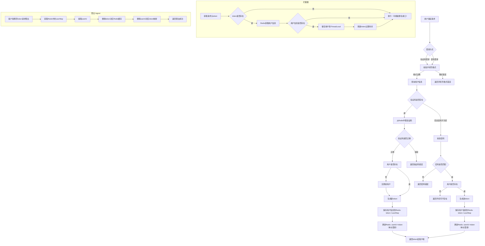
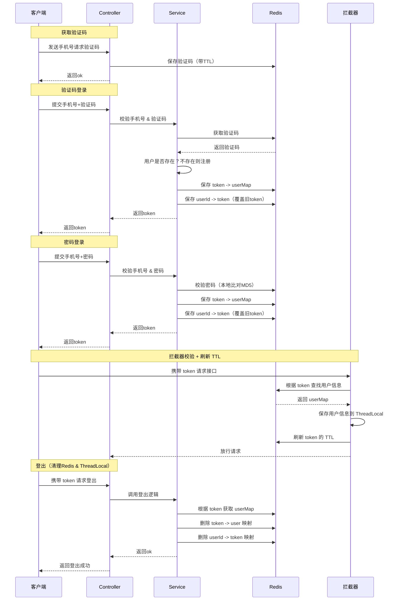

# 前言


## 导入SQL


## 导入后端项目


## 导入前端工程


# 短信登录

## 基于Session实现短信登录

**发送验证码：**

用户在提交手机号后，会校验手机号是否合法，如果不合法，则要求用户重新输入手机号

如果手机号合法，后台此时生成对应的验证码，同时将验证码进行保存，然后再通过短信的方式将验证码发送给用户

**短信验证码登录、注册：**

用户将验证码和手机号进行输入，后台从session中拿到当前验证码，然后和用户输入的验证码进行校验，如果不一致，则无法通过校验，如果一致，则后台根据手机号查询用户，如果用户不存在，则为用户创建账号信息，保存到数据库，无论是否存在，都会将用户信息保存到session中，方便后续获得当前登录信息

**校验登录状态:**

用户在请求时候，会从cookie中携带者JsessionId到后台，后台通过JsessionId从session中拿到用户信息，如果没有session信息，则进行拦截，如果有session信息，则将用户信息保存到threadLocal中，并且放行


### 发送验证码功能

#### 校验手机号

```java
package com.hmdp.utils;

public abstract class RegexPatterns {
	// 手机号正则
    public static final String PHONE_REGEX = "^1([38][0-9]|4[579]|5[0-3,5-9]|6[6]|7[0135678]|9[89])\\d{8}$";
    
	// 邮箱正则
    public static final String EMAIL_REGEX = "^[a-zA-Z0-9_-]+@[a-zA-Z0-9_-]+(\\.[a-zA-Z0-9_-]+)+$";
    
	// 密码正则。4~32位的字母、数字、下划线
    public static final String PASSWORD_REGEX = "^\\w{4,32}$";

	// 验证码正则, 6位数字或字母
    public static final String VERIFY_CODE_REGEX = "^[a-zA-Z\\d]{6}$";

}

```

手机号正则说明：

1. `^` - 表示匹配字符串的开始
2. `1` - 手机号码的第一位必须是1
3. `([38][0-9]|4[579]|5[0-3,5-9]|6[6]|7[0135678]|9[89])` - 匹配手机号码的第二位和第三位，这是一个分组，包含多个选项，用`|`分隔：
    - `[38][0-9]`：第二位是3或8，第三位是任意数字
    - `4[579]`：第二位是4，第三位是5、7或9
    - `5[0-3,5-9]`：第二位是5，第三位是0-3或5-9（注意这里有个逗号，应该是笔误，应该是`5[0-35-9]`）
    - `6[6]`：第二位是6，第三位是6
    - `7[0135678]`：第二位是7，第三位是0、1、3、5、6、7或8
    - `9[89]`：第二位是9，第三位是8或9
4. `\d{8}` - 匹配接下来的8位数字（\d表示任意数字，{8}表示重复8次）
5. `$` - 表示匹配字符串的结束

```java
package com.hmdp.utils;

import cn.hutool.core.util.StrUtil;

public class RegexUtils {
    /**
     * 是否是无效手机格式
     * @param phone 要校验的手机号
     * @return true:符合，false：不符合
     */
    public static boolean isPhoneInvalid(String phone){
        return mismatch(phone, RegexPatterns.PHONE_REGEX);
    }
    /**
     * 是否是无效邮箱格式
     * @param email 要校验的邮箱
     * @return true:符合，false：不符合
     */
    public static boolean isEmailInvalid(String email){
        return mismatch(email, RegexPatterns.EMAIL_REGEX);
    }

    /**
     * 是否是无效验证码格式
     * @param code 要校验的验证码
     * @return true:符合，false：不符合
     */
    public static boolean isCodeInvalid(String code){
        return mismatch(code, RegexPatterns.VERIFY_CODE_REGEX);
    }

    // 校验是否不符合正则格式
    private static boolean mismatch(String str, String regex){
        if (StrUtil.isBlank(str)) {
            return true;
        }
        return !str.matches(regex);
    }
}

```


#### 发送验证码

```java
@Override
public Result sendCode(String phone, HttpSession session) {
    // 1.校验手机号
    if (RegexUtils.isPhoneInvalid(phone)) {
        // 2.如果不符合，返回错误信息
        return Result.fail("手机号格式错误！");
    }
    // 3.符合，生成验证码
    String code = RandomUtil.randomNumbers(6);

    // 4.保存验证码到 session
    session.setAttribute("code",code);

    // 5.发送验证码
    log.debug("发送短信验证码成功，验证码：{}", code);
    // 返回ok
    return Result.ok();
}
```

**HttpSession**

`HttpSession` 是 Java Servlet 提供的一个接口，用于在服务端记录用户会话（session）信息。每一个用户在浏览器和服务器之间的交互，都会被服务端创建一个唯一的 `HttpSession` 对象来维护该用户的状态。

当用户第一次访问应用时，服务器会创建一个 `HttpSession` 实例，并分配一个唯一的 `Session ID`。这个 ID 会存储在浏览器的 Cookie 中，并在每次请求时自动发送给服务器，从而保持状态。


**Session ID 是如何返回给前端的？**

在 Web 应用中，**Session 用于保存用户的状态信息**，而前端和服务器之间的状态识别是通过 **Session ID** 实现的

第一次请求时（用户还没有 Session）：

1. 浏览器首次向服务器发起请求（如 `/user/code?phone=...`）
2. 服务器检测到请求中没有携带 `Session ID`，于是自动创建一个新的 `HttpSession` 对象
3. 系统为这个 `HttpSession` 分配一个唯一标识，比如：`JSESSIONID=ABC123XYZ456`
4. 服务器在响应头中添加内容：`Set-Cookie: JSESSIONID=ABC123XYZ456; Path=/; HttpOnly`
5. 浏览器接收响应后，会自动将这个 Cookie（JSESSIONID）保存下来

后续请求时（用户已建立 Session）：

1. 浏览器再次请求服务器（如 `/user/me`），自动携带 Cookie：Cookie: JSESSIONID=ABC123XYZ456
2. 服务器通过这个 ID 获取对应的 `HttpSession`，读取其中保存的信息（如验证码、用户登录状态等）


### 登录功能

#### 登录

```java
@Override
public Result login(LoginFormDTO loginForm, HttpSession session) {
    // 校验手机号
    String phone = loginForm.getPhone();
    if (RegexUtils.isPhoneInvalid(phone)) {
        // 2.如果不符合，返回错误信息
        return Result.fail("手机号格式错误！");
    }

    //根据手机号查询用户
    User user = query().eq("phone", phone).one();

    if (StrUtil.isNotBlank(loginForm.getCode())) {
        // 1）验证码登录
        // 校验验证码
        Object cacheCode = session.getAttribute("code");
        String code = loginForm.getCode();
        if(cacheCode == null || !cacheCode.toString().equals(code)){
            //3.不一致，报错
            return Result.fail("验证码错误");
        }

        //判断用户是否存在
        if(user == null){
            //不存在，则创建
            user =  createUserWithPhone(phone);
        }
        // 保存用户信息到session中
        session.setAttribute("user",user);

        return Result.ok();
    } else if (StrUtil.isNotBlank(loginForm.getPassword())) {
        // 2）密码登录

        //判断用户是否存在
        if(user == null){
            //不存在（不能创建用户）
            return Result.fail("手机号不存在");
        }

        // 校验密码
        String inputPassword = loginForm.getPassword();
        String inputPasswordMd5 = DigestUtils.md5Hex(inputPassword);
        if (!inputPasswordMd5.equals(user.getPassword())) {
            return Result.fail("密码输入错误");
        }

        // 保存用户信息到session中
        session.setAttribute("user",user);

        return Result.ok();
    } else {
        return Result.fail("登录失败");
    }
}

private User createUserWithPhone(String phone) {
    User user = new User();
    user.setPhone(phone);
    user.setNickName(USER_NICK_NAME_PREFIX + RandomUtil.randomString(10));
    user.setPassword(DigestUtils.md5Hex("123456"));
    save(user);
    return user;
}
```


#### 自动字段填充

创建新用户时，数据库的`create_time`和`update_time`需要自动填充

1）字段添加注解

```java
public class User implements Serializable {

    @TableField(fill = FieldFill.INSERT)
    private LocalDateTime createTime;

    @TableField(fill = FieldFill.UPDATE)
    private LocalDateTime updateTime;
}

```

2）实现 MetaObjectHandler

```java
package com.hmdp.config;

import com.baomidou.mybatisplus.core.handlers.MetaObjectHandler;
import lombok.extern.slf4j.Slf4j;
import org.apache.ibatis.reflection.MetaObject;
import org.springframework.stereotype.Component;

import java.time.LocalDateTime;

/**
 * 自动填充字段
 */
@Slf4j
@Component
public class MyMetaObjectHandler implements MetaObjectHandler {

    @Override
    public void insertFill(MetaObject metaObject) {
        log.info("开始插入填充...");
        this.strictInsertFill(metaObject, "createTime", LocalDateTime.class, LocalDateTime.now());
    }

    @Override
    public void updateFill(MetaObject metaObject) {
        log.info("开始更新填充...");
        this.strictUpdateFill(metaObject, "updateTime", LocalDateTime.class, LocalDateTime.now());
    }
}

```


#### 数据校验

1）引入依赖

```xml
<!-- 数据校验 -->
<dependency>
    <groupId>javax.validation</groupId>
    <artifactId>validation-api</artifactId>
</dependency>
<!-- 数据校验 -->
<dependency>
    <groupId>org.hibernate.validator</groupId>
    <artifactId>hibernate-validator</artifactId>
</dependency>
```

2）给`LoginFormDTO.java`添加注解

```java
public class LoginFormDTO {
    @NotBlank(message = "手机号不能为空")
    @Pattern(regexp = RegexPatterns.PHONE_REGEX, message = "手机号格式错误")
    private String phone;

    @Pattern(regexp = RegexPatterns.VERIFY_CODE_REGEX, message = "验证码格式错误")
    private String code;

    @Pattern(regexp = RegexPatterns.PASSWORD_REGEX, message = "密码格式错误")
    private String password;
}
```

3）Controller 方法上加 `@Valid`

```java
@PostMapping("/login")
public Result login(@RequestBody @Valid LoginFormDTO loginForm, HttpSession session){
    return userService.login(loginForm, session);
}
```

4）全局异常处理器

```java
package com.hmdp.exception;

import com.hmdp.dto.Result;
import lombok.extern.slf4j.Slf4j;
import org.springframework.validation.FieldError;
import org.springframework.web.bind.MethodArgumentNotValidException;
import org.springframework.web.bind.annotation.ExceptionHandler;
import org.springframework.web.bind.annotation.RestControllerAdvice;

/**
 * 全局异常处理器
 */
@RestControllerAdvice
@Slf4j
public class GlobalExceptionHandler {

    /**
     * 捕获数据校验异常
     * @param ex
     * @return
     */
    @ExceptionHandler(MethodArgumentNotValidException.class)
    public Result handleValidationExceptions(MethodArgumentNotValidException ex) {
        log.error("数据校验出现问题：{}，异常类型：{}", ex.getMessage(), ex.getClass());
        StringBuilder sb = new StringBuilder();
        for (FieldError error : ex.getBindingResult().getFieldErrors()) {
            sb.append(error.getDefaultMessage()).append("; ");
        }
        return Result.fail(sb.toString());
    }
}

```


#### md5加密

1）引入依赖

```xml
<!--md5加密-->
        <dependency>
            <groupId>commons-codec</groupId>
            <artifactId>commons-codec</artifactId>
        </dependency>
```

2）加密存储

```java
private User createUserWithPhone(String phone) {
    User user = new User();
    user.setPhone(phone);
    user.setNickName(USER_NICK_NAME_PREFIX + RandomUtil.randomString(10));
    user.setPassword(DigestUtils.md5Hex("123456"));
    save(user);
    return user;
}
```

3）加密对比

```java
// 校验密码
            String inputPassword = loginForm.getPassword();
            String inputPasswordMd5 = DigestUtils.md5Hex(inputPassword);
            if (!inputPasswordMd5.equals(user.getPassword())) {
                return Result.fail("密码输入错误");
            }
```


### 退出功能

```java
@PostMapping("/logout")
public Result logout(HttpSession session){
    session.removeAttribute("user");
    return Result.ok();
}
```

- 登录成功后你是通过 `session.setAttribute("user", userDTO)` 保存用户登录态的

- 用户每次请求时，Spring Boot 都会从当前 Session 中取出 `"user"`

- 登出时清除 `"user"`，就等于用户下次请求时被拦截器拦截（因为检测不到登录信息）


### 实现登录拦截功能


1）编写拦截器

```java
package com.hmdp.interceptor;

import com.hmdp.entity.User;
import com.hmdp.utils.UserHolder;
import org.springframework.web.servlet.HandlerInterceptor;

import javax.servlet.http.HttpServletRequest;
import javax.servlet.http.HttpServletResponse;
import javax.servlet.http.HttpSession;

/**
 * 登录拦截器
 */
public class LoginInterceptor implements HandlerInterceptor {

    @Override
    public boolean preHandle(HttpServletRequest request, HttpServletResponse response, Object handler) throws Exception {
        //1.获取session
        HttpSession session = request.getSession();
        //2.获取session中的用户
        Object user = session.getAttribute("user");
        //3.判断用户是否存在
        if(user == null){
            //4.不存在，拦截，返回401状态码
            response.setStatus(401);
            return false;
        }
        //5.存在，保存用户信息到Threadlocal
        UserHolder.saveUser((User) user);
        //6.放行
        return true;
    }

    @Override
    public void afterCompletion(HttpServletRequest request, HttpServletResponse response, Object handler, Exception ex) throws Exception {
        UserHolder.removeUser(); // 清理 ThreadLocal
    }
}

```

2）配置MvcConfig，让拦截器生效

```java
package com.hmdp.config;

import com.hmdp.interceptor.LoginInterceptor;
import org.springframework.context.annotation.Configuration;
import org.springframework.web.servlet.config.annotation.InterceptorRegistry;
import org.springframework.web.servlet.config.annotation.WebMvcConfigurer;

@Configuration
public class MvcConfig implements WebMvcConfigurer {
    
    @Override
    public void addInterceptors(InterceptorRegistry registry) {
        // 登录拦截器
        registry.addInterceptor(new LoginInterceptor())
                .excludePathPatterns(
                        "/shop/**",
                        "/voucher/**",
                        "/shop-type/**",
                        "/upload/**",
                        "/blog/hot",
                        "/user/code",
                        "/user/login"
                ).order(1);
    }
}
```

3）封装ThreadLocal

```java
package com.hmdp.utils;

import com.hmdp.entity.User;

public class UserHolder {
    private static final ThreadLocal<User> tl = new ThreadLocal<>();

    public static void saveUser(User user){
        tl.set(user);
    }

    public static User getUser(){
        return tl.get();
    }

    public static void removeUser(){
        tl.remove();
    }
}

```


## Session共享问题


## 基于Redis实现短信登录

[基于Redis实现短信登录的相关图](#图)


同时Redis保存userId -> token的映射，用于实现单点登录


### 发送验证码

```java
public Result sendCode(String phone, HttpSession session) {
    // 1.校验手机号
    if (RegexUtils.isPhoneInvalid(phone)) {
    // 2.如果不符合，返回错误信息
    return Result.fail("手机号格式错误！");
    }
    // 3.符合，生成验证码
    String code = RandomUtil.randomNumbers(6);

    // 4.保存验证码到 redis
    stringRedisTemplate.opsForValue().set(LOGIN_CODE_KEY + phone, code, LOGIN_CODE_TTL, TimeUnit.MINUTES);

    // 5.发送验证码
    log.debug("发送短信验证码成功，验证码：{}", code);

    // 返回ok
    return Result.ok();
}
```


### 登录（单点登录）

```java
public Result login(LoginFormDTO loginForm, HttpSession session) {
    // 校验手机号
    String phone = loginForm.getPhone();
    if (RegexUtils.isPhoneInvalid(phone)) {
        // 如果不符合，返回错误信息
        return Result.fail("手机号格式错误！");
    }

    //根据手机号查询用户
    User user = query().eq("phone", phone).one();

    if (StrUtil.isNotBlank(loginForm.getCode())) {
        // 1）验证码登录
        // 校验验证码
        String cacheCode = stringRedisTemplate.opsForValue().get(LOGIN_CODE_KEY + phone);
        String code = loginForm.getCode();
        if(cacheCode == null || !cacheCode.equals(code)){
            //不一致，报错
            return Result.fail("验证码错误");
        }

        //判断用户是否存在
        if(user == null){
            //不存在，则创建
            user =  createUserWithPhone(phone);
        }
        // 保存用户（已存在）信息到redis中
        String token = saveLoginUser(user);

        // 返回token
        return Result.ok(token);
    } else if (StrUtil.isNotBlank(loginForm.getPassword())) {
        // 2）密码登录

        //判断用户是否存在
        if(user == null){
            //不存在（不能创建用户）
            return Result.fail("手机号不存在");
        }

        // 校验密码
        String inputPassword = loginForm.getPassword();
        String inputPasswordMd5 = DigestUtils.md5Hex(inputPassword);
        if (!inputPasswordMd5.equals(user.getPassword())) {
            return Result.fail("密码输入错误");
        }

        // 保存用户信息到redis中
        String token = saveLoginUser(user);

        // 返回token
        return Result.ok(token);
    } else {
        return Result.fail("登录失败");
    }
}


private String saveLoginUser(User user) {
    String oldToken = stringRedisTemplate.opsForValue().get(LOGIN_USER_ID + user.getId());
    if (StrUtil.isNotBlank(oldToken)) {
        log.info("删除旧token");
        stringRedisTemplate.delete(LOGIN_USER_KEY + oldToken);
    }

   Map<String, Object> userMap = BeanUtil.beanToMap(user, new HashMap<>(), CopyOptions.create().setIgnoreNullValue(true).setFieldValueEditor((fieldName, fieldValue) -> fieldValue.toString()));
    String token = UUID.randomUUID().toString(true);
    stringRedisTemplate.opsForHash().putAll(LOGIN_USER_KEY + token, userMap);
    stringRedisTemplate.expire(LOGIN_USER_KEY + token, Duration.ofMinutes(LOGIN_USER_TTL)); // 设置过期时间

    stringRedisTemplate.opsForValue().set(LOGIN_USER_ID + user.getId(), token, Duration.ofMinutes(LOGIN_USER_TTL));

    return token;
}
```


### 拦截器


1）LoginInterceptor

```java
package com.hmdp.interceptor;

import com.hmdp.utils.UserHolder;

import org.springframework.web.servlet.HandlerInterceptor;
import javax.servlet.http.HttpServletRequest;
import javax.servlet.http.HttpServletResponse;


/**
 * 登录拦截器
 */
public class LoginInterceptor implements HandlerInterceptor {
    @Override
    public boolean preHandle(HttpServletRequest request, HttpServletResponse response, Object handler) throws Exception {
        // 1.判断是否需要拦截（ThreadLocal中是否有用户）
        if (UserHolder.getUser() == null) {
            // 没有，需要拦截，设置状态码
            response.setStatus(401);
            // 拦截
            return false;
        }
        // 有用户，则放行
        return true;
    }
}

```

2）RefreshTokenInterceptor

```java
package com.hmdp.interceptor;

import cn.hutool.core.bean.BeanUtil;
import cn.hutool.core.util.StrUtil;
import com.hmdp.entity.User;
import com.hmdp.utils.RedisConstants;
import com.hmdp.utils.UserHolder;
import org.springframework.data.redis.core.StringRedisTemplate;
import org.springframework.web.servlet.HandlerInterceptor;

import javax.servlet.http.HttpServletRequest;
import javax.servlet.http.HttpServletResponse;
import java.util.Map;
import java.util.concurrent.TimeUnit;

public class RefreshTokenInterceptor implements HandlerInterceptor {
    private StringRedisTemplate stringRedisTemplate;

    public RefreshTokenInterceptor(StringRedisTemplate stringRedisTemplate) {
        this.stringRedisTemplate = stringRedisTemplate;
    }

    @Override
    public boolean preHandle(HttpServletRequest request, HttpServletResponse response, Object handler) throws Exception {
        //1.获取请求头中的token
        String token = request.getHeader("authorization");

        if (StrUtil.isBlank(token)) {
            return true;
        }

        //2.获取Redis中的用户
        Map<Object, Object> userMap = stringRedisTemplate.opsForHash().entries(RedisConstants.LOGIN_USER_KEY + token);
        //3.判断用户是否存在
        if(userMap.isEmpty()){
            return true;
        }
        //5.存在，保存用户信息到Threadlocal
        User user = BeanUtil.fillBeanWithMap(userMap, new User(), false);
        UserHolder.saveUser(user);
        // 6.刷新token
        stringRedisTemplate.expire(RedisConstants.LOGIN_USER_KEY + token, RedisConstants.LOGIN_USER_TTL, TimeUnit.MINUTES);
        //7.放行
        return true;
    }

    @Override
    public void afterCompletion(HttpServletRequest request, HttpServletResponse response, Object handler, Exception ex) throws Exception {
        UserHolder.removeUser(); // 清理 ThreadLocal
    }
}

```

3）配置MvcConfig，让拦截器生效

```java
package com.hmdp.config;

import com.hmdp.interceptor.LoginInterceptor;
import com.hmdp.interceptor.RefreshTokenInterceptor;
import org.springframework.context.annotation.Configuration;
import org.springframework.data.redis.core.StringRedisTemplate;
import org.springframework.web.servlet.config.annotation.InterceptorRegistry;
import org.springframework.web.servlet.config.annotation.WebMvcConfigurer;

import javax.annotation.Resource;

@Configuration
public class MvcConfig implements WebMvcConfigurer {

    @Resource
    private StringRedisTemplate stringRedisTemplate;

    @Override
    public void addInterceptors(InterceptorRegistry registry) {
        // 登录拦截器
        registry.addInterceptor(new LoginInterceptor())
                .excludePathPatterns(
                        "/shop/**",
                        "/voucher/**",
                        "/shop-type/**",
                        "/upload/**",
                        "/blog/hot",
                        "/user/code",
                        "/user/login"
                ).order(1);
        // token刷新拦截器
        registry.addInterceptor(new RefreshTokenInterceptor(stringRedisTemplate)).addPathPatterns("/**").order(0);
    }
}
```


### 退出功能

1）Controller

```java
@PostMapping("/logout")
public Result logout(@RequestHeader("authorization") String token){
    userService.logout(token);
    return Result.ok();
}
```

2）UserServiceImpl

```java
@Override
public void logout(String token) {
    // 1. 从 Redis 中获取用户信息
    Map<Object, Object> userMap = stringRedisTemplate.opsForHash().entries(RedisConstants.LOGIN_USER_KEY + token);
    Object userId = userMap.get("id"); // 立刻获取 userId，防止 Redis 中数据已被删或被并发清空

    // 2. 删除 Redis 中的 token -> 用户信息 映射
    stringRedisTemplate.delete(LOGIN_USER_KEY + token);
    log.info("删除Redis中的 token 映射");

    // 3. 删除 Redis 中的 userId -> token 映射
    if (userId != null) {
        stringRedisTemplate.delete(LOGIN_USER_ID + userId);
        log.info("删除Redis中的 userId 映射");
    }
}
```


# 图

## 基于Redis实现短信登录

### 流程图



### 时序图



