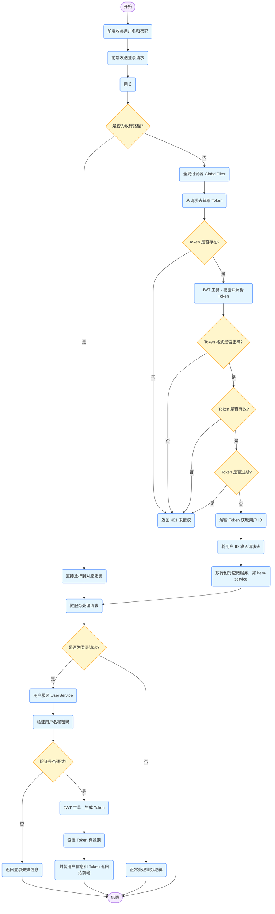
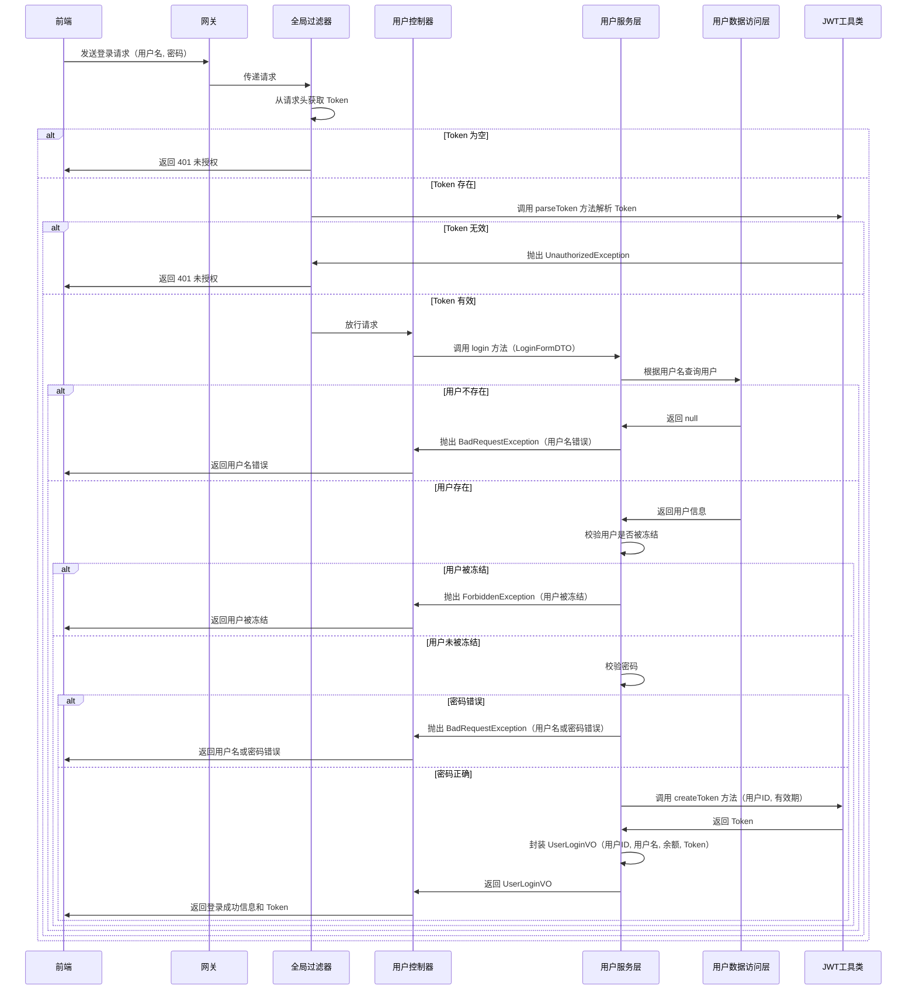

# 案例

## 黑马点评


## emall


## hmall

[Note/微服务笔记.md at main · jinpeng1666/Note](https://github.com/jinpeng1666/Note/blob/main/微服务笔记.md#网关登录校验)


### JWT


### 过滤器


# 实现技术

## Session

### 介绍

**HttpSession**

`HttpSession` 是 Java Servlet 提供的一个接口，用于在服务端记录用户会话（session）信息。每一个用户在浏览器和服务器之间的交互，都会被服务端创建一个唯一的 `HttpSession` 对象来维护该用户的状态。

当用户第一次访问应用时，服务器会创建一个 `HttpSession` 实例，并分配一个唯一的 `Session ID`。这个 ID 会存储在浏览器的 Cookie 中，并在每次请求时自动发送给服务器，从而保持状态。


**Session ID 是如何返回给前端的？**

在 Web 应用中，**Session 用于保存用户的状态信息**，而前端和服务器之间的状态识别是通过 **Session ID** 实现的

第一次请求时（用户还没有 Session）：

1. 浏览器首次向服务器发起请求（如 `/user/code?phone=...`）
2. 服务器检测到请求中没有携带 `Session ID`，于是自动创建一个新的 `HttpSession` 对象
3. 系统为这个 `HttpSession` 分配一个唯一标识，比如：`JSESSIONID=ABC123XYZ456`
4. 服务器在响应头中添加内容：`Cookie: JSESSIONID=ABC123XYZ456`
5. 浏览器接收响应后，会自动将这个 Cookie（JSESSIONID）保存下来

后续请求时（用户已建立 Session）：

1. 浏览器再次请求服务器（如 `/user/me`），自动携带 Cookie：Cookie: JSESSIONID=ABC123XYZ456
2. 服务器通过这个 ID 获取对应的 `HttpSession`，读取其中保存的信息（如验证码、用户登录状态等）


### 共享问题


## JWT

WT 是一个 **字符串令牌**，由三部分组成：

```
复制编辑
xxxxx.yyyyy.zzzzz
```

1. **Header**：令牌头部，标明签名算法
2. **Payload**：有效载荷，通常包含用户 ID、角色、过期时间等信息
3. **Signature**：签名部分，防篡改（用密钥+前两部分生成的）

**验证流程**：

- 后端收到 JWT → 拿出 Header 和 Payload → 用秘钥计算签名 → 对比 JWT 的签名部分 → 签名一致即有效


**优点**

- 无需服务器存储状态，天生支持分布式

- 跨服务间传递用户信息方便（比如 OAuth、微服务）

- 灵活自定义 Payload（如角色、权限等）

**缺点**

- **无法主动失效**：即使用户退出登录，JWT 仍可被用到过期

- **泄露风险高**：一旦被截获，除非过期，服务端无法拦截

- **内容暴露**：Payload 是 Base64 编码的，任何人都能看到里面的内容（敏感信息需加密）


## JWT 和 Session ID 的联系

- Session 是“服务器存”，JWT 是“客户端存”
- 都是用来“识别当前用户”的方式
- 都可用于实现登录态管理
- 浏览器端通常都用 Cookie 或 LocalStorage 保存它们
- 发送请求时，后端通过解析这些“令牌”来识别用户身份


## 核心区别

| 对比项           | Session ID                             | JWT（JSON Web Token）                              |
| ---------------- | -------------------------------------- | -------------------------------------------------- |
| **存储位置**     | 服务端（Session 保存在内存、Redis 等） | 客户端（JWT 保存在 Cookie 或 LocalStorage）        |
| **身份验证过程** | 查找 Session（通过 Session ID）        | 验签 JWT 自身是否有效                              |
| **服务端状态**   | 有状态（需记录每个用户的 Session）     | 无状态（不记录状态，完全靠 JWT 自身的信息）        |
| **扩展性**       | 多节点需共享 Session（如 Redis）       | 天生支持分布式，节点无状态                         |
| **安全性**       | Session ID 若被盗用可伪装用户          | JWT 若泄露也能伪装用户，但无法销毁（除非设置过期） |
| **大小和开销**   | 小（只传一个 Session ID）              | 相对较大（JWT 是完整数据包 + 签名）                |
| **登出控制**     | 可以立即销毁 Session                   | 无法主动注销 JWT（只能等它过期）                   |


# 图

## hmall

### 流程图



### 时序图




