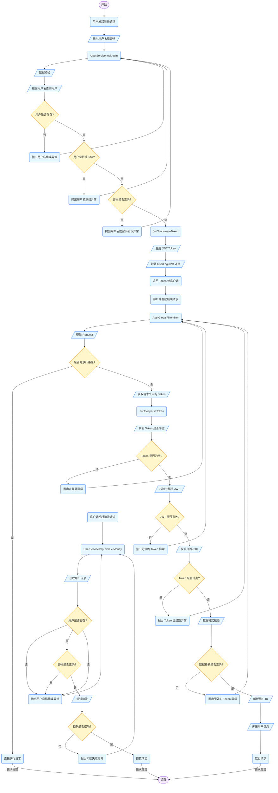
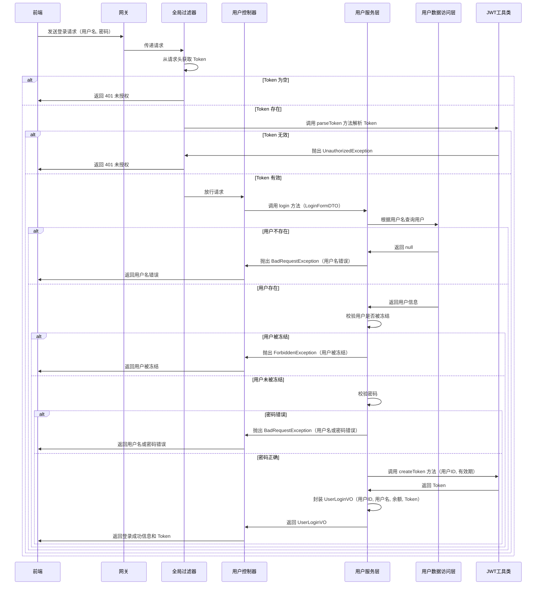

# 案例

## 黑马点评

> [!NOTE]
>
> 相关笔记：[Note/实战项目/黑马点评.md at main · jinpeng1666/Note](https://github.com/jinpeng1666/Note/blob/main/实战项目/黑马点评.md#短信登录)


## emall


## hmall

> [!NOTE]
>
> 相关笔记：[Note/微服务笔记.md at main · jinpeng1666/Note](https://github.com/jinpeng1666/Note/blob/main/微服务笔记.md#网关登录校验)


### JWT

登录校验需要用到JWT，而且JWT的加密需要秘钥和加密工具。这些在`hm-service`中已经有了，我们直接拷贝过来：


具体作用如下：

- `AuthProperties`：配置登录校验需要拦截的路径，因为不是所有的路径都需要登录才能访问
- `JwtProperties`：定义与JWT工具有关的属性，比如秘钥文件位置
- `SecurityConfig`：工具的自动装配
- `JwtTool`：JWT工具，其中包含了校验和解析`token`的功能
- `hmall.jks`：秘钥文件

其中`AuthProperties`和`JwtProperties`所需的属性要在`application.yaml`中配置：

```YAML
hm:
  jwt:
    location: classpath:hmall.jks # 秘钥地址
    alias: hmall # 秘钥别名
    password: hmall123 # 秘钥文件密码
    tokenTTL: 30m # 登录有效期
  auth:
    excludePaths: # 无需登录校验的路径
      - /search/**
      - /users/login
      - /items/**
```


#### AuthProperties

```java
package com.hmall.gateway.config;

import lombok.Data;
import org.springframework.boot.context.properties.ConfigurationProperties;
import org.springframework.stereotype.Component;

import java.util.List;

@Data
@Component
@ConfigurationProperties(prefix = "hm.auth")
public class AuthProperties {
    private List<String> includePaths;
    private List<String> excludePaths;
}

```

用于配置登录校验需要拦截和放行的路径


#### JwtProperties

```java
package com.hmall.gateway.config;

import lombok.Data;
import org.springframework.boot.context.properties.ConfigurationProperties;
import org.springframework.core.io.Resource;

import java.time.Duration;

@Data
@ConfigurationProperties(prefix = "hm.jwt")
public class JwtProperties {
    private Resource location;
    private String password;
    private String alias;
    private Duration tokenTTL = Duration.ofMinutes(10);
}

```


#### SecurityConfig

```java
package com.hmall.gateway.config;

import org.springframework.boot.context.properties.EnableConfigurationProperties;
import org.springframework.context.annotation.Bean;
import org.springframework.context.annotation.Configuration;
import org.springframework.security.crypto.bcrypt.BCryptPasswordEncoder;
import org.springframework.security.crypto.password.PasswordEncoder;
import org.springframework.security.rsa.crypto.KeyStoreKeyFactory;

import java.security.KeyPair;

@Configuration
@EnableConfigurationProperties(JwtProperties.class)
public class SecurityConfig {

    @Bean
    public PasswordEncoder passwordEncoder(){
        return new BCryptPasswordEncoder();
    }

    @Bean
    public KeyPair keyPair(JwtProperties properties){
        // 获取秘钥工厂
        KeyStoreKeyFactory keyStoreKeyFactory =
                new KeyStoreKeyFactory(
                        properties.getLocation(),
                        properties.getPassword().toCharArray());
        //读取钥匙对
        return keyStoreKeyFactory.getKeyPair(
                properties.getAlias(),
                properties.getPassword().toCharArray());
    }
}
```

`SecurityConfig` 类通过 `KeyStoreKeyFactory` 从 `hmall.jks` 文件中读取 `KeyPair`（包含公钥和私钥）


#### hmall.jks

 `hmall.jks` 是 Java KeyStore（JKS）文件，用于存储加密密钥和证书。在 JWT 的使用中，它提供了用于签名和验证的公钥和私钥。通过 `SecurityConfig` 类从 `hmall.jks` 文件中读取 `KeyPair`，

- **签名和验证**：在生成 JWT 时，使用私钥对 JWT 进行签名；在验证 JWT 时，使用公钥来验证签名的有效性。这样可以确保 JWT 在传输过程中没有被篡改，并且确实是由持有相应私钥的一方生成的
- **安全性**：将私钥存储在 JKS 文件中，并通过密码进行保护，可以提高私钥的安全性。只有知道 JKS 文件密码和私钥别名的人才能获取到私钥


#### JwtTool

```java
package com.hmall.gateway.util;

import cn.hutool.core.exceptions.ValidateException;
import cn.hutool.jwt.JWT;
import cn.hutool.jwt.JWTValidator;
import cn.hutool.jwt.signers.JWTSigner;
import cn.hutool.jwt.signers.JWTSignerUtil;
import com.hmall.common.exception.UnauthorizedException;
import org.springframework.stereotype.Component;

import java.security.KeyPair;
import java.time.Duration;
import java.util.Date;

@Component
public class JwtTool {
    private final JWTSigner jwtSigner;

    public JwtTool(KeyPair keyPair) {
        this.jwtSigner = JWTSignerUtil.createSigner("rs256", keyPair);
    }

    /**
     * 创建 access-token
     *
     * @param userId 用户信息
     * @return access-token
     */
    public String createToken(Long userId, Duration ttl) {
        // 1.生成jws
        return JWT.create()
                .setPayload("user", userId)
                .setExpiresAt(new Date(System.currentTimeMillis() + ttl.toMillis()))
                .setSigner(jwtSigner)
                .sign();
    }

    /**
     * 解析token
     *
     * @param token token
     * @return 解析刷新token得到的用户信息
     */
    public Long parseToken(String token) {
        // 1.校验token是否为空
        if (token == null) {
            throw new UnauthorizedException("未登录");
        }
        // 2.校验并解析jwt
        JWT jwt;
        try {
            jwt = JWT.of(token).setSigner(jwtSigner);
        } catch (Exception e) {
            throw new UnauthorizedException("无效的token", e);
        }
        // 2.校验jwt是否有效
        if (!jwt.verify()) {
            // 验证失败
            throw new UnauthorizedException("无效的token");
        }
        // 3.校验是否过期
        try {
            JWTValidator.of(jwt).validateDate();
        } catch (ValidateException e) {
            throw new UnauthorizedException("token已经过期");
        }
        // 4.数据格式校验
        Object userPayload = jwt.getPayload("user");
        if (userPayload == null) {
            // 数据为空
            throw new UnauthorizedException("无效的token");
        }

        // 5.数据解析
        try {
           return Long.valueOf(userPayload.toString());
        } catch (RuntimeException e) {
            // 数据格式有误
            throw new UnauthorizedException("无效的token");
        }
    }
}
```

- **`JWTSigner`**：`JWTSigner` 是用于对 JWT 进行签名的工具。在 JWT 中，签名是确保 JWT 完整性和真实性的重要步骤
- **`JwtTool` 构造函数**：该构造函数接收一个 `KeyPair` 对象作为参数，使用 `JWTSignerUtil.createSigner("rs256", keyPair)` 方法创建一个 `JWTSigner` 实例。`"rs256"` 表示使用 RSA 算法进行签名，这是一种非对称加密算法，使用私钥进行签名，公钥进行验证。`keyPair` 包含了 RSA 算法所需的公钥和私钥

- **`JWT.create()`**：这是使用 Hutool 库创建一个 JWT 构建器实例，用于构建 JWT 的各个部分
- **`setPayload("user", userId)`**：在 JWT 的负载（payload）部分添加一个键值对，键为 `"user"`，值为用户的 ID。负载部分可以包含一些用户信息或其他需要传递的数据
- **`setExpiresAt(new Date(System.currentTimeMillis() + ttl.toMillis()))`**：设置 JWT 的过期时间。`ttl` 是一个 `Duration` 对象，表示令牌的有效期。通过 `System.currentTimeMillis()` 获取当前时间的毫秒数，加上 `ttl` 的毫秒数，得到过期时间的毫秒数，再创建一个 `Date` 对象作为过期时间
- **`setSigner(jwtSigner)`**：设置 JWT 的签名工具为之前创建的 `jwtSigner` 实例
- **`sign()`**：使用设置的签名工具对 JWT 进行签名，并返回签名后的 JWT 字符串

### Gateway

网关登录校验主要由`hm-gateway`模块负责，通过全局过滤器`AuthGlobalFilter`对请求进行拦截和校验


前端请求不能直接访问微服务，而是要请求网关：

- 网关可以做安全控制，也就是登录身份校验，校验通过才放行
- 通过认证后，网关再根据请求判断应该访问哪个微服务，将请求转发过去


#### 网关过滤器


#### 登录校验过滤器

代码如下：

```Java
package com.hmall.gateway.filter;

import com.hmall.common.exception.UnauthorizedException;
import com.hmall.common.utils.CollUtils;
import com.hmall.gateway.config.AuthProperties;
import com.hmall.gateway.util.JwtTool;
import lombok.RequiredArgsConstructor;
import org.springframework.boot.context.properties.EnableConfigurationProperties;
import org.springframework.cloud.gateway.filter.GatewayFilterChain;
import org.springframework.cloud.gateway.filter.GlobalFilter;
import org.springframework.core.Ordered;
import org.springframework.http.server.reactive.ServerHttpRequest;
import org.springframework.http.server.reactive.ServerHttpResponse;
import org.springframework.stereotype.Component;
import org.springframework.util.AntPathMatcher;
import org.springframework.web.server.ServerWebExchange;
import reactor.core.publisher.Mono;

import java.util.List;

@Component
@RequiredArgsConstructor
@EnableConfigurationProperties(AuthProperties.class)
public class AuthGlobalFilter implements GlobalFilter, Ordered {

    private final JwtTool jwtTool;

    private final AuthProperties authProperties;

    private final AntPathMatcher antPathMatcher = new AntPathMatcher();

    @Override
    public Mono<Void> filter(ServerWebExchange exchange, GatewayFilterChain chain) {
        // 1.获取Request
        ServerHttpRequest request = exchange.getRequest();
        // 2.判断是否不需要拦截
        if(isExclude(request.getPath().toString())){
            // 无需拦截，直接放行
            return chain.filter(exchange);
        }
        // 3.获取请求头中的token
        String token = null;
        List<String> headers = request.getHeaders().get("authorization");
        if (!CollUtils.isEmpty(headers)) {
            token = headers.get(0);
        }
        // 4.校验并解析token
        Long userId = null;
        try {
            userId = jwtTool.parseToken(token);
        } catch (UnauthorizedException e) {
            // 如果无效，拦截
            ServerHttpResponse response = exchange.getResponse();
            response.setRawStatusCode(401);
            return response.setComplete();
        }

        // TODO 5.如果有效，传递用户信息
        System.out.println("userId = " + userId);
        // 6.放行
        return chain.filter(exchange);
    }

    private boolean isExclude(String antPath) {
        for (String pathPattern : authProperties.getExcludePaths()) {
            if(antPathMatcher.match(pathPattern, antPath)){
                return true;
            }
        }
        return false;
    }

    @Override
    public int getOrder() {
        return 0;
    }
}
```


### UserServiceImpl

```java
public UserLoginVO login(LoginFormDTO loginDTO) {
    // 1.数据校验
    String username = loginDTO.getUsername();
    String password = loginDTO.getPassword();
    // 2.根据用户名或手机号查询
    User user = lambdaQuery().eq(User::getUsername, username).one();
    Assert.notNull(user, "用户名错误");
    // 3.校验是否禁用
    if (user.getStatus() == UserStatus.FROZEN) {
        throw new ForbiddenException("用户被冻结");
    }
    // 4.校验密码
    if (!passwordEncoder.matches(password, user.getPassword())) {
        throw new BadRequestException("用户名或密码错误");
    }
    // 5.生成TOKEN
    String token = jwtTool.createToken(user.getId(), jwtProperties.getTokenTTL());
    // 6.封装VO返回
    UserLoginVO vo = new UserLoginVO();
    vo.setUserId(user.getId());
    vo.setUsername(user.getUsername());
    vo.setBalance(user.getBalance());
    vo.setToken(token);
    return vo;
}
```


# 实现技术

## Session

### 介绍

**HttpSession**

`HttpSession` 是 Java Servlet 提供的一个接口，用于在服务端记录用户会话（session）信息。每一个用户在浏览器和服务器之间的交互，都会被服务端创建一个唯一的 `HttpSession` 对象来维护该用户的状态。

当用户第一次访问应用时，服务器会创建一个 `HttpSession` 实例，并分配一个唯一的 `Session ID`。这个 ID 会存储在浏览器的 Cookie 中，并在每次请求时自动发送给服务器，从而保持状态。


**Session ID 是如何返回给前端的？**

在 Web 应用中，**Session 用于保存用户的状态信息**，而前端和服务器之间的状态识别是通过 **Session ID** 实现的

第一次请求时（用户还没有 Session）：

1. 浏览器首次向服务器发起请求（如 `/user/code?phone=...`）
2. 服务器检测到请求中没有携带 `Session ID`，于是自动创建一个新的 `HttpSession` 对象
3. 系统为这个 `HttpSession` 分配一个唯一标识，比如：`JSESSIONID=ABC123XYZ456`
4. 服务器在响应头中添加内容：`Cookie: JSESSIONID=ABC123XYZ456`
5. 浏览器接收响应后，会自动将这个 Cookie（JSESSIONID）保存下来

后续请求时（用户已建立 Session）：

1. 浏览器再次请求服务器（如 `/user/me`），自动携带 Cookie：Cookie: JSESSIONID=ABC123XYZ456
2. 服务器通过这个 ID 获取对应的 `HttpSession`，读取其中保存的信息（如验证码、用户登录状态等）


### 共享问题


## JWT

> [!NOTE]
>
> 官方文档：[概述](https://www.hutool.cn/docs/#/jwt/概述)

Hutool提供了零依赖的JWT（JSON Web Token）实现

 JWT（JSON Web Token）是一种用于在网络应用中安全传输信息的开放标准（RFC 7519），是一个**字符串令牌**，由三部分组成：

```
header.payload.signature
```

1. **Header**：令牌头部，标明签名算法
2. **Payload**：有效载荷，通常包含用户 ID、角色、过期时间等信息
3. **Signature**：签名部分，防篡改（用密钥+前两部分生成的）

### 验证流程

- 后端收到 JWT → 拿出 Header 和 Payload → 用秘钥计算签名 → 对比 JWT 的签名部分 → 签名一致即有效


### 优点

- 无需服务器存储状态，天生支持分布式

- 跨服务间传递用户信息方便（比如 OAuth、微服务）

- 灵活自定义 Payload（如角色、权限等）

### 缺点

- **无法主动失效**：即使用户退出登录，JWT 仍可被用到过期

- **泄露风险高**：一旦被截获，除非过期，服务端无法拦截

- **内容暴露**：Payload 是 Base64 编码的，任何人都能看到里面的内容（敏感信息需加密）


### 使用

JWT模块的核心主要是两个类：

1. `JWT`类用于链式生成、解析或验证JWT信息。
2. `JWTUtil`类主要是JWT的一些工具封装，提供更加简洁的JWT生成、解析和验证工作


## JWT 和 Session ID 的联系

- Session 是“服务器存”，JWT 是“客户端存”
- 都是用来“识别当前用户”的方式
- 都可用于实现登录态管理
- 浏览器端通常都用 Cookie 或 LocalStorage 保存它们
- 发送请求时，后端通过解析这些“令牌”来识别用户身份


## 核心区别

| 对比项           | Session ID                             | JWT（JSON Web Token）                              |
| ---------------- | -------------------------------------- | -------------------------------------------------- |
| **存储位置**     | 服务端（Session 保存在内存、Redis 等） | 客户端（JWT 保存在 Cookie 或 LocalStorage）        |
| **身份验证过程** | 查找 Session（通过 Session ID）        | 验签 JWT 自身是否有效                              |
| **服务端状态**   | 有状态（需记录每个用户的 Session）     | 无状态（不记录状态，完全靠 JWT 自身的信息）        |
| **扩展性**       | 多节点需共享 Session（如 Redis）       | 天生支持分布式，节点无状态                         |
| **安全性**       | Session ID 若被盗用可伪装用户          | JWT 若泄露也能伪装用户，但无法销毁（除非设置过期） |
| **大小和开销**   | 小（只传一个 Session ID）              | 相对较大（JWT 是完整数据包 + 签名）                |
| **登出控制**     | 可以立即销毁 Session                   | 无法主动注销 JWT（只能等它过期）                   |


# 图

## hmall

### 登录流程图




### 时序图



